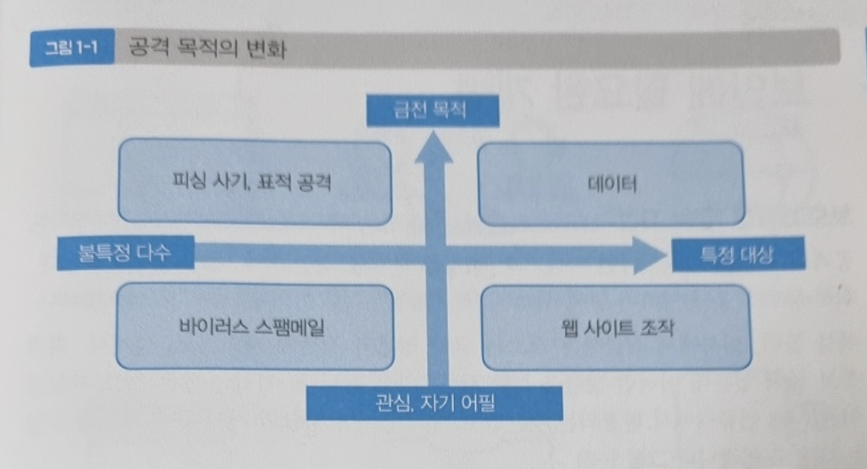
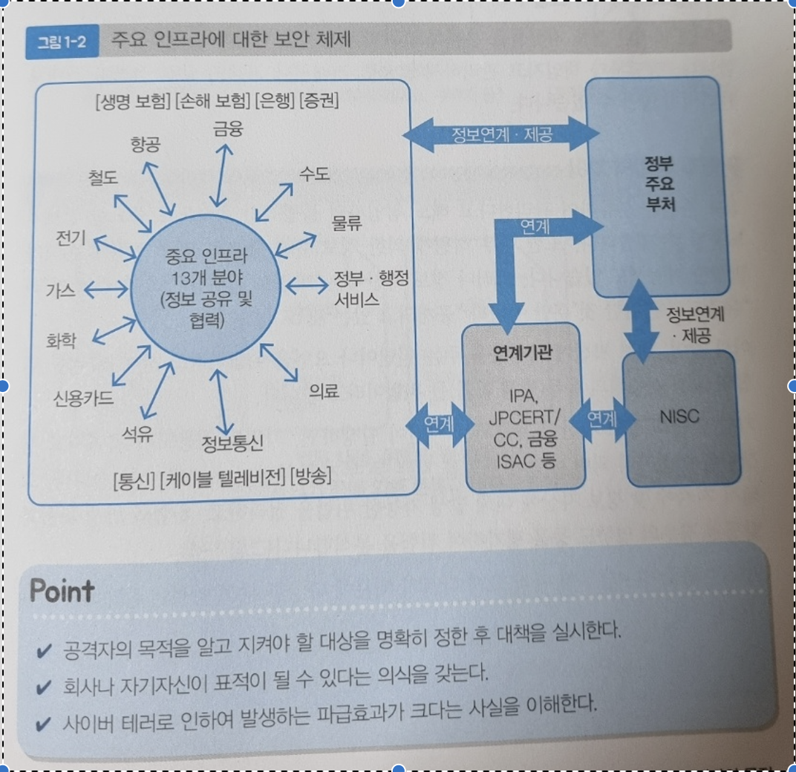

## chap1 보안의 기본 개념

### 1. 공격자의 목적
---
#### 목적은 관심에서 금전 탈취로
- 보안은 무엇으로부터 어떤걸 지켜야 하는가 생각을 해야한다.
- 공격자가 무엇을 노리고 있는지 그 목적을 생각하는 것부터 해야 대책을 마련할 수 있다.
- 과거 공격자들은 `바이러스 등의 기술력을 과시`하기 위해 불특정 다수에게 공격을 해왔다.
- 또한 일부 웹사이트를 공격하여 내용을 바뀌게 하여 소동을 즐기려는 목적으로 행해지며 `자신의 주장을 어필하기 위해 해킹(크래킹)하는 것을 핵티비즘`(Hacktivism : 정치 사회 목적으로 자신과 노선을 달리하는 정부, 기업 등 단체들의 웹사이트를 해킹하는 행위)이라 부른다
- 이런 과거의 행적들에 비해 21세기 공격자의 목적이 `금전`으로 변해갔다.
- 특정 기업이나 조직이 보유하는 개인정보를 훔치고 판매함으로 `개인정보는 돈이된단` 인식이 퍼진다.
- 공격하고 있다는 것을 눈치채지 못하도록 은밀하게 공격이 진행된다.
- 이 행위들로 바이러스 등으로 웹사이트를 감염시키는 행위가 정보를 갈취하고 금전으로 바꾸는 수단 이 되어버렸다.

#### 사이버 테러의 위협
- 인터넷 등을 이용하여 자행하는 대규모 테러행위를 `사이버 테러`라고 한다.
- 사회에 필요한 인프라(전력, 가스, 수도)를 마비시키기 위해 발전소를 노리거나, 철도나 비행기 등 교통 기반시설에 대한 공격으로 인해 피해가 발생한다.
- 정부 기관등을 중심으로 `다양한 대책`들이 만들어 지고 있다.

