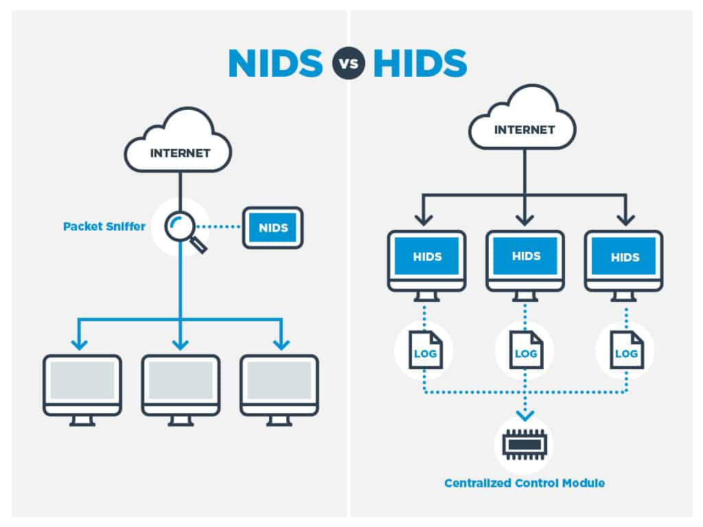
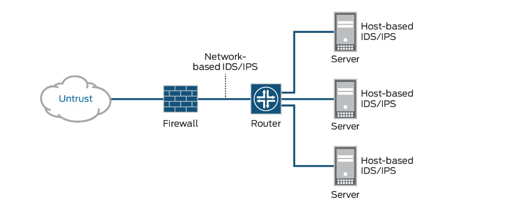
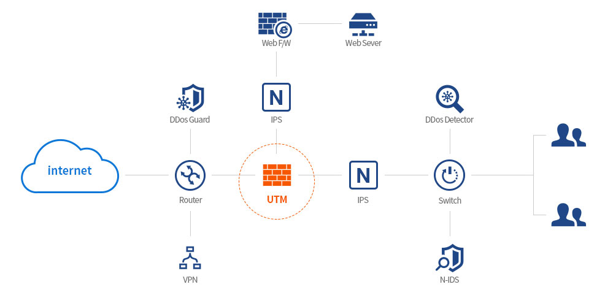
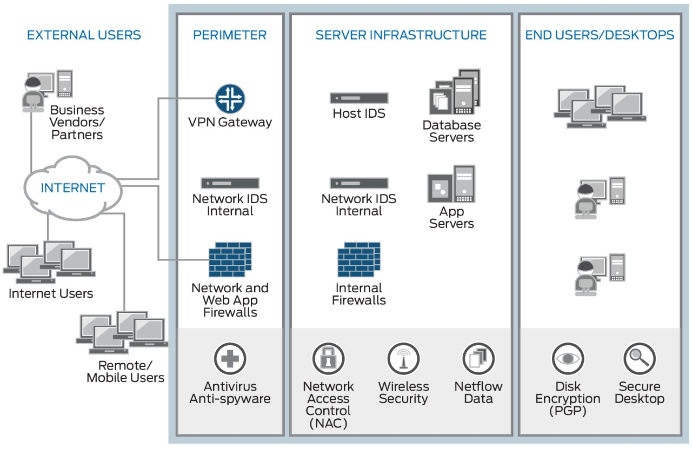

### 11. 외부로부터의 침입을 탐지 방지 (IDS, IPS)

#### 외부로부터의 침입을 탐지한다.
- 외부로부터 부정한 접속을 방지하기 위해 방화벽을 사용하지만, 부정한 접속화 정상적인 통신을 간단하게  구별할 수는 없다.
  - 예) 웹서버에 대량 접속이 단시간에 발생하는 경우
- 이렇게 외부로부터 공격받은 것을 탐지하기 위해, IDS(Instrusion Detection System, 침입 방지 시스템)이 사용된다.
- IDS에서는 네트워크 유형 IDS(NIDS)와 호스트 유형 IDS(HIDS)가 있다.
- NIDS
  - 네트워크에 설치하는 IDS로 소위 감시카메라와 같은 역할을 한다.
  - 모니터링만 하므로 침입한 것을 탐지할 수는 있지만 막을 수는 없다.
  - 패턴 매칭 등의 방법을 이용하여 부정한 통신을 감지하는 것 외에 일반적인 상태에서는 발생하지 않는 통신 상황을 이상형상으로 감지
- HIDS
  - 호스트(컴퓨터)에 설치하는 IDS
  - 집에 설치하는 홈 보안 센서와 같은 역할을 한다고 생각하면 이해하기 쉽다
  - 센서가 확인하는 영역에 어떤 변화가 발생하면 탐지하고 통지한다.
  - 개별 컴퓨터에 도입되기 떄문에 운영상의 부담은 크지만 탐지할 수 있는 것들은 많아진다.

#### 외부로부터 침입을 방지한다.
- IDS는 침입을 탐지만 하기 때문에 대응이 늦어지는 경향이 있다.
- 침입을 확인하고 대책을 세우려고 할 땐 이미 기밀 정보가 유출된 후가 될지도 모른다.
- IPS(Intrusion Prevention System, 침입방지시스템)의 도입도 검토하게 된다.
- IPS
  - 기차를 탈 때 사용하는 자동 개찰구와 같은 역할을 한다.
  - 부정하다고 판단된 승객의 입장을 막는 것과 같이, 잘못된 통신이 IPS를 통과하려고 할 때 탐지하고 통신을 차단한다.
- IPS는 침입이라고 판단된 통신을 차단하기 때문에, 잘못된 참지가 발생하면 업무에 영향이 발생하게 된다.
- 그러한 상황을 피하고 싶은 경우에는 IDS가 사용된다.
- IPS(출처 : 주니퍼 네트웍스)

#### Point
- IDS에는 NIDS와 HIDS가 있고 부정한 접속이나 특이한 접속의 탐지가 가능하다.
- IPS를 사용하면 불법 통신을 차단할 수 있지만, 잘못 탐지하는 경우에 대한 고려가 필요하다.

### 12. 집중 관리로 대책의 효과를 높인다(UTM, SIEM)
#### 1개 하드웨어 보안을 향상시킬 수 있는 UTM
- 방화벽이나 IDS/IPS, 바이러스 백신 소프트웨어 등을 개별적으로 도입하면서 각각을 따로 운용함에 있어서 큰 부하가 발생한다.
- 이러한 것들을 하나의 제품으로 정리한 것이 UTM(Unified Threat Management, 통합 위협 관리)이다.
- 1개의 하드웨어로 보안을 향상시킬 수 있기 때문에, 중소기업 등에서 관리에 소요되는 시간과 인력을 구비하기 어려운 경우에 많이 사용되고 있다.
- 한편 하나의 장비에 통신이 집중하기 때문에 쓰루풋(Throughput, 단위 시간당 처리 전송할 수 있는 정보의 양)성능이 낮아지고, 장애가 발생하는 경우 파급되는 영향이 커지는 단점도 있다.
- UTM(사진출처 안랩)

#### 관리자가 인시던트를 발견하기 위한 "SIEM"
- UTM을 사용하여도 모든 공격을 막을 수 없다.
- 점점 정교해지고 잇는 공격에 대해 "어떻게 비정상적인 상황을 인식하고 발생 원인을 조사할 것인가"에 대한 대응 방안이 필요하다.
- 가까운 예로 화재가 발생했을 때 실제로 연기를 보고 냄새를 맡는 것으로 감지할 수 있다.
- 경우에 따라서는 비상벨이 울려서 귀로 들을 수 있다.
- 보안에서도 담당자가 신속하게 파악할 수 있는 구조가 필요하다.
- 어떤 사고가 일어난 경우 이를 통합적으로 파악하는 접근법을 SIEM(Security Information and Event Management)이라고 한다.
- 서버가 제공하는 로그 뿐만 아니라 네트워크 모니터링 결과와 이용자가 사용하고 있는 컴퓨터가 제공하는 다양한 로그를 통합하여 실시간으로 정보를 수집하고 표시한다.
- 담당자는 그 화면을 보는 것만으로 어떠한 이상 현상이 발생하고 있는지 파악할 수 있다.
- SIEM (출처 : 주니퍼 네트웍스)

#### Point
- UTM을 도입하면 보안 장비들의 관리 비용을 절감할 수 있다.
- 다양한 보안 장비들로부터 발생되는 로그를 SIEM에서 한꺼번에 모아 관리함으로써 관리 담당자가 확인해야 할 정보를 통합할 수 있다.