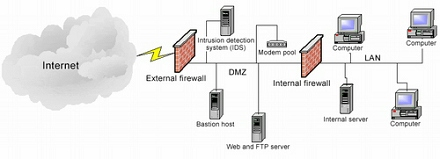
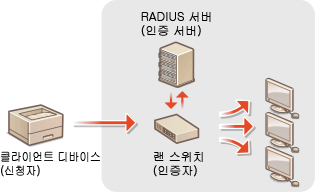

### 13. 네트워크를 분할한다(DMZ, 검역네트워크)
#### 네트워크의 완충지대 DMZ(비무장지대 맞음)
- 네트워크를 설계할 때 크게 3개의 영역으로 나누어 생각할 수 있다.
- 그것은 내부영역, 외부에 공개하는 영역, 인터넷영역이다.
- 여기에서 생각해야 할 것은 "보안을 고려함에 있어 서로 다르게 취급해야 하는 영역"이다.
- 네트워크의 규모아 처리 정보의 중요성에 따라 내부 영역에 대해서 보다 세밀하게 나눌 필요가 있을지도 모른다.
- 외부에 공개하는 영역은 웹 서버나, 메일 서버, DNS서버, FTP서버 등이 설치된다.
- 인터넷에 공개하는 서버이므로 불특정 다수가 접근하는 특징이 있다.
- 이처럼 인터넷과 내부 네트워크의 중간에 위치하는 영역을 DMZ(Demilitarized Zone: 비무장지대)라고 부른다.
- 완충지대의 역할을 수행한다.
- DMZ(사진출처 : zdnet)

#### 의심스러운 컴퓨터의 접속을 방지하는 "검역 네트워크"
- 외부로부터 노트북 PC를 반입해 사내 네트워크에 연결하는 경우 만약 해당 PC가 바이러스에 감염되어 있다면, 바이러스가 회사 내부의 컴퓨터들로 확산될 가능성이 있다.
- 방화벽을 사용하여 분할하는 방안에서는 회사 외부와 내부의 네트워크를 분할할 수 있지만, 내부적으로 연결된 경우는 막을 수 없다.
- 그래서 회사 내부 네트워크에 연결하기 전에 일시적으로 연결할 수 있는 검역 네트워크를 사용하여 격리하고 안전을 확인한 후 내부 네트워크에 연결
- 이렇게 하면 모든 컴퓨터들은 반드시 보안 검사를 받은 후 사용할 수 있게 된다.
- 검역 네트워크에서는 OS업데이트 및 바이러스 백신 소프트웨어 정의 파일 업데이트도 할 수 있어 안전성을 높일 수 있다.

#### Point
- DMZ 사용으로 인터넷 등 외부와 통신하는 서버를 내부 네트워크와 분리할 수 있다.
- 보안이 의심스러운 컴퓨터는 내부 네트워크에 직접 연결하는 것이 아니라, 검역 네트워크에 연결하여 안전성을 높일 수 있다

### 14. 네트워크 접속을 관리한다.(MAC 주소 필터링)
#### 접속 가능한 단말기를 제한한다.
- 사전에 이미 등록되어 있는 컴퓨터는 내부 네트워크에 연결시키고 싶지 않은 경우가 있다.
- 이러한 경우 스위치 등 네트워크 장비를 이용하여 접속을 관리하는 대표적인 방법으로 MAC주소를 이용한 필터링(MAC Address Filtering)이 있다.
- 접속이 허용된 기기의 MAC주소를 미리 등록해 두는 것으로, 등록되지 않은 MAC주소를 가진 기기가 접속되는 것을 방지하는 기능이다.
- 등록되지 않은 기기를 연결하려고 할 때 해당 포트를 자동으로 정지시킬 수 있다.
- 그러나 MAC주소는 도구를 사용해 변경할 수 있기 때문에 허가된 PC인 것처럼 위장하여 접속할 수 있다.
- 또한 접속하는 기기들이 증가하게 되면, 관리대상 MAC주소의 숫자도 증가하기 때문에 운영 관리 비용이 증가하는 문제도 있다.

#### 무선 LAN 접속제한 효과는 한정적
- MAC주소는 유선 네트워크 뿐만 아니라 무선 LAN 액세스 포인트(Access Point)에서 접속을 제한하는 경우에도 사용할 수 있다.
- 무선 LAN 네트워크는 전파가 도달하는 범위라면 어디서나 접속할 수 있으므로 정규 사용자 이외에는 사용할 수 없도록 해야한다.
- 그러나 위에서와 같이 MAC주소는 변경될 수 있으므로 다른 대책과 병용하지 않으면 보안의 효과가 제한적이 될 수밖에 없다.
- 마찬가지로, 무선 LAN접속을 관리하기 위해 SSID 스텔스(Stealth)가 사용되는 경우가 있다.
- SSID Stealth
  - 무선 LAN 액세스 포인트의 식별자인 SSID를 알지 못하도록 숨기는 기능으로, 잘못 접속되는 것을 방지하는 것에는 효과적이지만 안전성을 높인다는 의미에서는 효과가 미미하다고 알려져 있다.
  - 숨겨진 SSID를 표시하는 도구가 존재하며 전파가 미치는 영역에 있는 액세스 포인트 목록을 쉽게 볼 수 있다.

#### Point
- MAC주소 필터링을 사용하여 네트워크에 접속할 수 있는 장치를 제한할 수 있지만, 접속하는 기기가 늘어나면 관리하기 힘들어진다.
- 무선 LAN의 MAC주소와 SSID 스텔스는 보안 측면에서 효과가 한정적이라는 것을 이해한 후 사용하여야 한다.

### 15. 안전한 통신을 실현한다.
#### 무선  LAN관련 암호화 방식의 변화
- 무선 LAN을 사용하면 전파가 닿는 범위 내라면 벽 등의 장애물이 있어도 통신할 수 있다.
- 유선 케이블이 필요 없어 편리한 반면, 악의적인 사람으로부터 표적이 되기 쉬운 환경이라도 할 수 있다.
- 전파는 눈에 보이지 않기 때문에 부정하게 접속되어 있어도 알아내기 어렵다.
- 무선 LAN의 보안 설정 중에서도 항상 주목해야 하는 것은 암호화 방식이다.
- 통신 중간에 내용이 보여진다거나 위조되는 것을 막기 위해 사용되지만, 이 암호화 방식을 적절하게 선택하지 않으면 단시간 내에 암호문이 해독되어 통신 내용이 도청될 가능성이 있다.
- 과거에는 WEP라는 암호화 방식이 많이 사용되었지만, 지금은 단시간에 암호를 해독하는 방법이 발견되었기 때문에 WPA방식 또는 WPA2 방식으로 암호화 하는 것이 권장되고 있다.

#### 악의적인 액세스 포인트
- 실제로 존재하는 정규 액세스 포인트와 동일한 SSID 및 암호화 키가 설정된 액세스 포인트가 공격자에 의해 설치되어 있는 경우도 있다.
- 만약 과거 접속했던 정규 액세스 포인트 정보가 단말기에 저장되어 있다면, 공격자가 설치한 악의적인 액세스 포인트에 자동으로 접속될 수 있다.
- 이러한 액세스 포인트에 접속하면 통신 내용이 제 3자에게 알려져서 악용될 우려가 있다.
  
#### IEEE802.1X에 의한 인증
- LAN에 접속하는 단말기를 제한하기 위해 사용되는 인증 규격으로 IEEE 802.1X가 있다.
- 인증 장치와 인증 서버의 준비가 필요하기 때문에 도입이 어렵지만, 기업 등에서 접속하는 단말기를 제핞고자 하는 경우에는 효과적인 대책이 된다.
- 무선 LAN뿐만 아니라 유선에서도 사용할 수 있다.

#### Point
- 무선 LAN 통신의 암호화 방식에는 WPS, WPA, WPA2등의 방식들이 있지만, 현재는 WPA및 WPA2의 사용이 권고되고 있다.
- 접속하는 단말기를 제한이라면 IEEE 802.1X 인증을 수행하면 된다.

#### 번외 (출처 꺼무위키)
- WPA
  - 기존의 WEP가 너무 짧은 암호화 패킷으로 암호화를 했던것을 강화해서 내놓은 규격이다. 
  - 이 규격을 발표하면서 TKIP라는 암호화 방식도 새로 개발되었는데, 당시에 WEP는 64, 128비트로 패킷을 암호화 하지만, 한번 만들어지면 절대 바뀌지 않는 암호화 키 때문에 보안이 쉽게 뚫렸다.
  - WPA는 이러한 단점을 보완해서 한 패킷에 한번씩 지속적으로 암호화를 해서 보안을 더 철저히 한다.
- WPA2
  - IEEE에서 2004년에 발표한 새로운 암호화 규격이다. 
  - WPA에서 AES-CCMP방식으로 암호화를 추가 지원하며, TKIP는 암호화 방식에서 제외되었다. 
  - 또한, WPA2에서는 암호가 일정 길이 이상이 되어야 한다.