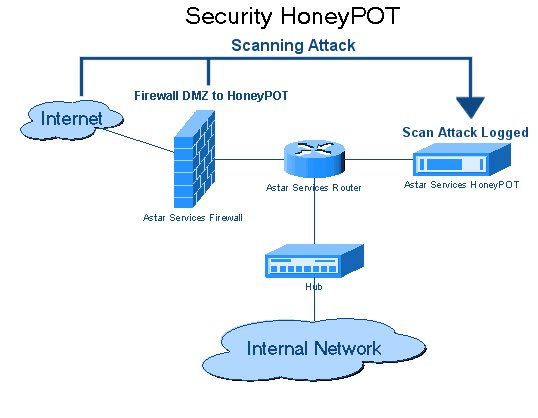

## 3. 바이러스 및 스파이웨어
### 1. 악성코드의 종류(바이러스, 웜, 트로이 목마)
#### 바이러스에는 여러가지 유형이 존재한다.
- 최근에는 악성 소프트웨어를 총칭하여 악성코드라고 부르는 경우가 많다.
  - 악성 소프트웨어의 종류
    - 바이러스
      - 다른 프로그램에서 기생하여 작동
    - 웜
      - 스스로 자기복제
    - 트로이목마
      - 정상적인 프로그램인 것처럼 위장하여 자기 증식은 안함
    - 스파이웨어
      - 정보를 훔쳐감
  - 여기서 바이러스, 웜, 트로이목마 포함하여 "광의의 바이러스"라고 부른다.
- 여기서는 협의의 바이러스로 매크로나 스크립트를 사용하는 것을 생각해보자
- 예를들어 Word Exceld=의 매크로를 사용하면 수동 입력 등을 자동화할 수 있지만 이 기능을 악용하면 피해를 끼치는 작업을 수행하게 된다.
- 이러한 파일을 매크로 바이러스라고 부르며, 파일을 여는 순간에 실행되는 경우가 있다.
- 이외에도 Adobe Reader등 스크립트를 실행할 수 있는 소프트웨어에 존재하는 취약점을 악용하여 PDF등 언뜻 보기에 문제없어 보이는 파일을 열기만 해도 감염시키는 유형도 있다.
- 바이러스의 종류

|기능|특징|
|-|-|
|1. 자가복제 기능 | 자기가 가지고 있는 기능으로 다른 프로그램에서 자신을 복제하거나 시스템 기능을 이용하여 자기를 다른 시스템에 복제하는 것으로 다른 시스템을 감염시키는 기능|
|2. 잠복기능 | 발병하기 위해서는 특정 시각, 일정한 시간, 처리 횟수 등의 조건을 기억시켜 발병할 때 까지 감염된 증상을 나타내지 않는 기능
|3. 발병 기능| 프로그램, 데이트 등의 파일을 손상시키거나, 설계자가 의도하지 않은 동작을 하는 기능|

#### 독립적으로 실행 가능한 "웜"과 숨어서 활동하는 "트로이 목마"
- 다른 소포트웨어가 필요한 바이러스와는 다르게 독립적으로 실행하는 특징을 가진 소프트웨어를 웜이라고 한다.
- 네트워크를 통해서 다른 컴퓨터를 감염시키고, 자가 복제를 한다.
- 경우에 따라서는 인터넷에 연결되어있는 것만으로ㅗ 다른 컴퓨터를 감염시킬 수 있다.
- 트로이 목마는 유용한 프로그램처럼 보이지만, 실제로는 정보를 몰래 뺴내기 위해 사용되는 소프트웨어로 사용자가 실수로 다운로드 하게 되는 경우도 있다.
- 웜처럼 다른 컴퓨터를 감염시키는 것은 아니지만 2-6에 등장하는 백도여를 만들기 위해 사용되는 것이 일반적이다.

#### Point
- 바이러스는 "광의의 바이러스"와 "협의의 바이러스"로 구분되여 최근에는 악성코드(Malicious code)라는 말도 사용되고 있다.
- 바이러스 정의에서 웜은 "자가복제 기능",트로이 목마는 "잠복기능"에 해당한다.

### 2. 바이러스 백신 클래식
#### 바이러스 백신 소프트웨어는 패턴 업데이트가 필수
- 바이러스 백신 소프트웨어 제조업체는 기존의 바이러스를 수집하여 바이러스가 있는 파일의 특징을 패턴(Pattern) 파일(바이러스 정의 파일)로 제공한다.
- 바이러스 백신 소프트웨어는 이 패턴과 비교함으로써 바이러스를 탐지하여 경고하거나 삭제한다.
- 바이러스를 만드는 사람은 당연히 패턴 파일에 적합하지 않도록 바이러스를 새롭게 만들고 있다.
- 반면, 바이러스 백신 소프트웨어어 제조사들은 패턴 파일을 업데이트하고 있다.
- 다람쥐 챗바퀴 도는 것 같지만, 최근의 바이러스에 대응하기 위해서는 이 패턴파일을 항상 최신 상태로 유지하는 것이 중요하다.
- 업데이트를 하지 않으면 새로 생겨난 바이러스에 대응할 수 없기 때문에 자동 업데이트 설정을 하는 것 뿐만 아니라 제대로 업데이트되었는지 정기적으로 확인해야한다.

#### 바이러스와 유사한 동작을 찾아내는 동작감지
- 패턴 파일을 준비하는 방법에서는, 최근 파일이 제공될 때 까지 이용자는 바이러스에 감염을 막을 수 없다.
- 그래서 최근의 바이러스 백신 소프트웨어는 동작감시, 기능을 제공한다.
- 일반적인 바이러스는 일정한 간격으로 서버와 통신하고 컴퓨터의 내부를 마음대로 조사하기도 한다.
- 그래서 이러한 동작을 하는 프로그램의 행동을 탐지해서 해당 프로그램의 실행을 중지한다
- 이 방법을 사용하면, 알려지지 않은 바이러스라도 지금까지의 바이러스와 유사한 움직임을 하는 경우엔 감지를 통해 실행을 중지할 수 있다.
- 다만, 비슷한 움직임을 보이는 정상적인 프로그램도 감지하기 때문에, 잘못된 탐지를 할 가능성이 높다.
 
#### Point
- 바이러스 백신 소프트웨어 패턴은 기존 바이러스의 특징을 정리한 것, 항상 최신 상태로 유지하는 것이 중요
- 알 수 없는 바이러스에 대응하기 위해 동작 감지 구조를 가진 바이러스 백신 소프트웨어가 늘고 있다.

### 3. 바이러스에 대응하는 소프트웨어 기술
#### 인터넷에 함정을 설치
- 동작감지 기능을 보유하고 있다고 해도 바이러스 백신 소프트는 패턴 파일이 중요하다.
- 이 패턴을 생성하기 위해서는 바이러스 백신 소프트웨어 제조업체가 바이러스를 수집해야 한다.
- 바이러스를 수집하기 위해 사용되는 것이 허니팟(Honey pot)이다.
- 소위 "미끼"로 인터넷에 설치되는데, 외관과 동작은 실제 사용되고 있는 컴퓨터와 유사하게 만들어 졌고, 바이러스 및 부정한 접속 공격에 취약하도록 설정되어 있다.
- 공격하기 쉬운 환경이므로, 바이러스 제작자와 공겨자가 공격 대상으로 노리고 있다.
- 이처럼 실제로는 사용되지 않은 환경을 "실제 시스템" 인 것처럼 보이게 하여 이곳이 공격받도록 하고 바이러스를 수집하는 것.
- 패턴파일을 만드는데 도움을 준다.
- 허니팟

#### 프로그램의 동작을 확인하는 샌드박스
- 샌드박스(기업명 아닙니다.)
  - 동작 감지를 하기 위해 실제 컴퓨터가 아닌 가상으로 프로그램을 실행할 수 있는 환경을 제공
  - 모래 상자로 번역되며 안전한 장소를 제공한다는 의미
- 본래의 컴퓨터에 영향을 주지 않도록 샌드박스에서 실행함으로 만약 대상 프로그램이 바이러스인 경우에도 피해를 줄일 수 있다.
- 샌드박스에서 실행된 프로그램이 어떤 행동을 하고 있는지 확인하여 바이러스 검출에 활용되고 있다.
- 바이러스 백신 소프트웨어에도 유사한 기능을 가지는 것이 있으며, 소프트웨어를 다운로드한 경우에 한번에 실행되지 않고 샌드박스환경에서 실행함으로 동작을 확인할 수 있다.

#### Point
- 공격 기법이나 바이러스를 수집하는데 허니팟이 도움이 될 수 있다.
- 샌드박스에 의해 본래의 컴퓨터에 영향을 주지 않고 프로그램의 동작을 확인할 수 있다.
