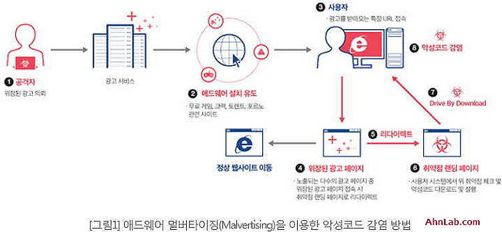
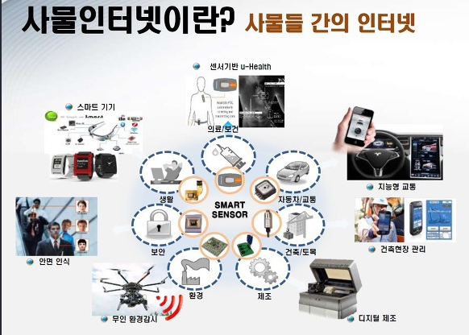

### 9. 주의 해야 할 기타 웹 위협(드라이브 바이 다운로드, 파일 공유 서비스)
#### 모르는 사이에 소프트웨어가 다운로드된다.
- 드라이브 바이 다운로드 란?
  - 웹 사이트를 조회하는 것만으로 소프트웨어가 다운로드 되도록 하는 행위를 "드라이브 바이 다운로드(Drive by downloads)"라고 한다.
  - 화면에 아무것도 표시되지 않으며 사용자가 사용자가 알지 못하는 사이에 바이러스 등 악성 프로그램을 다운로드 하고 있을 가능성이 있다.
- 수상한 사이트를 방문하지 않으면 안전할 것으로 생각하지만, 기업이 제공하는 공식 웹사이트가 변조되어 해당 사이트에 접속한 사람들을 자동으로 악의적인 웹 사이트로 유도하게끔 만들어 진 것도 있다.
- 드라이브 바이 다운로드가 발생되지 않도록 OS나 웹 브라우저 등에서 대응이 이루어지고 있지만, 취약점 악용이나, 바이러스 감염 등에 의해 대응이 유효하지 않을 때가 있다.
- 드라이브 바이 다운로드

#### 설정을 잘못하면 위험한 "파일 공유 서비스"
- 파일이 대용량이어서 메일로 첨부할 수 없는 경우에 파일 공유 서비스등을 사용하고 있다.(구글 드라이브, 드롭박스 등)
- 최근에는 클라우드 기반의 파일 공유 서비스도 많이 볼 수 있으며, 백업 등에도 편리하게 사용되고 있다.
- 그러나 대용량 파일 전달은 위험하다.
- 개인정보나 기밀정보가 포함된 파일 등을 공유해버리면 전 세계에 공개 되어버릴 가능성이 있다.
- 본인이 인식하지 못하는 상태에서 실수로 인하여 공개되도록 설정을 하게 되는 경우가 있으며, 바이러스에 감염되어 있어 임의로 파일이 업로드되거나 공개 관련 설정이 변경되어 버리는 경우가 있다.
- 특히 "파일 교환 소프트웨어"라고 하는 P2P(Peer to Peer) 형태의 네트워크에서는 주의가 필요하다.

#### Point
- 드라이브 바이 다운로드의 경우 임의로 소프트웨어가 다운로드 되고 있어도 이용자는 눈치채지 못한다.
- 파일 공유 서비스는 편리하지만, 마음대로 공개되도록 설정되어 있지 않은지 확인이 필요하다.
- 파일 공유 서비스와 파일 공유 소프트웨어를 사용하는 경우 개인정보나 기밀 정보 등의 정보 유출에 주의해야 한다.
- P2P형태의 파일 공유 소프트웨어인 경우 한 번 공개되면 단번에 전 세계로 배포되어 버릴 가능성이 있다.

### 10. 바이러스 감염은 PC만이 아니다(IoT기기의 바이러스)
- IoT란
  - 사물 인터넷이란 뜻
  - 사물에 센서와 통신 기능을 내장하여 인터넷에 연결하는 기술. 즉, 무선 통신을 통해 각종 사물을 연결하는 기술을 의미. 

#### 항상 인터넷에 연결되어 있는 IoT기기
- 인터넷에 항상 연결되어 있으면 외부로부터 공격을 받거나 바이러스에 감염될 가능성이 있다.
- 특히 라우터 등의 장비는 항상 인터넷에 연결되어 있다.
- 또한 최근에는 Web 카메라 등 외부로부터 접속하는 데 사용되는 기기도 증가하고 있다.
- 인터넷에 연결하면 편리한 IoT기기가 보급되면서 PC나 스마트폰 이외에도 바이러스 감염 피해가 보고되고 있다.
- 그 이유 중의 하나로 이용자의 낮은 보안 의식을 들 수 있다.
- 가전 기기처럼 생각해서 인터넷에 연결되어 있다는 것의 위험성을 이해하지 못하고, 핫픽스(Hotfix, 긴급 업데이트) 등이 제공되고 있는 것을 알지 못하는 등 이용자의 낮은 보안 의식이 문제로 지적되고 있다.

#### 차례 차례 등장하는 변종
- IoT 기기를 겨냥한 Mirai라는 악성 코드가 발견되고 그것의 소스코드가 인터넷 상에 공개되었다.
- 이것으로 인해 소스코드를 약간만 바꾸면 누구나 악성코드의 변종을 만들 수 있게 되었다.
- IoT기기에는 디스플레이 화면이 없는 기기들도 많으며, 바이러스 백신 소프트웨어 등도 사용되지 않는다.
- 따라서 감염된 것을 눈치채지 못한 상태에서 사용하는 경우가 존재하며, 외부로 공격하는 가해자가 되어버릴 가능성도 있다.
- 앞으로도 IoT기기의 종류가 늘어날 것으로 예상되며, 이에 따라 공격도 고도화 될 것으로 생각된다.
- 기본적인 대책으로 PC와 마찬가지로 암호를 복잡하게 변경하고 핫픽스(Hotfix)를 적용하는 것이 중요하다.
