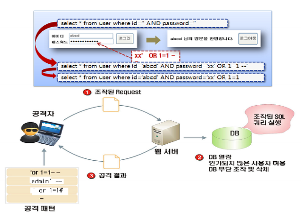
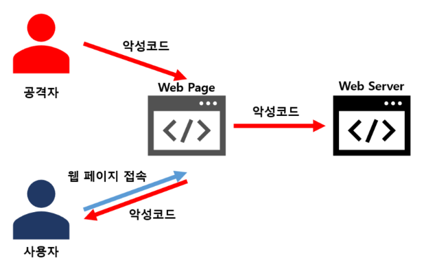

### 4. 데이터베이스를 부정하게 조작

#### 데이터베이스와 SQL
- 쇼핑 사이트 등을 만들떄, 상품의 재고 상황 및 고객 정보등 입력한 내용을 서버에 저장할 필요가 있는데, 이 떄 사용되는 것이 데이터베이스이다.
- 데이터베이스를 사용하면 여러 사용자가 접속하는 경우에도 일관성을 확보할 수 있을 뿐 아니라, 데이터의 검색 및 가공을 효율적으로 실행할 수 있다.
- 데이터베이스와 관련하여 데이터의 등록 및 갱신, 검색, 삭제 등의 작업은 SQL이라는 언어를 작성하여 수행하게 된다.
- 이 SQL작성을 목표로 한 공격이 발생할 수 있다.


#### 데이터베이스의 취약점 'SQL 인젝션'
- SQL구문은 이용자에게 보이지 않지만, 그 처리에는 이용자가 입력한 내용이 포함되어 있다.
- 그래서 입력 내용에 특수한 문자를 포함시키는 것만으로, 응용 프로그램이 예상치 못했던 조작을 부정하게 수행할 수 있게 되는 경우가 있다.
- 예를 들면 검색 사이트라면 키워드를, 회원 등록이라면 이메일 주소와 비밀번호를, 상품을 구매할 때는 집주소와 주문 번호 등을 입력하게 된다.
- 이러한 내용을 입력할 때 특수문자가 포함되면 프로그램은 데이터의 조작이나 정보 유출, 시스템 종료 등으로 이루어질 수 있다.
- 이러한 취약점을 "SQL인젝션(injection)"이라고 부르며 많은 피해가 발생하고 있지만, 이용자가 할 수 있는 대책은 없다.
- 개발자의 무지로 인해 발생하는 경우 뿐만 아니라, 짧은 기간에 개발을 하면서 입력 값에 대한 점검이 제대로 이뤄지지 않는 경우에도 발생할 수 있다.
- 서비스 공급자는 시스템을 개발함에 있어서 공격의 구조를 이해하고, 취약점 진단 등의 대책을 실시해야 한다.
- SQL 인젝션의 예시(출처 : 행정안전부)


```
HTML을 포함한 게시물 예시)
<b>보안구조</b>
<a href="https://www.youngjin.com">
영진닷컴 </a> 출판 --> a라는 태그라고하는 것은 클릭하면
href에 작성된 사이트로 이동하게끔 하는 기능을 함


Script를 포함한 게시물 예시
<script type="text/javascript">
alert(document.cookie); //실행시 대화상자가 표시됨
</script>

```

#### Point
- SQL 인젝션 취약점이 존재해도 이용자가 할 수 있는 대책은 없다.
- 개발자는 공격이 일어나는 방식을 이해한 후, 취약점 진단 등의 대책을 실시해야 한다.

### 5. 여러 사이트를 횡단하는 공격
#### 사이트를 전반적으로 공격하는 "크로스 사이트 스크립팅"
- 웹 사이트 중에 게시판을 제공하여 이용자가 게시물을 올릴 수 있는 형태의 서비스가 다수 존재한다.
- 이 떄 이용자가 입력한 내용이 그대로 게시되는 구조라면 문제가 발생하는 경우가 있다.
- 크로스 사이트 스크립팅(Cross Site Scripting, 축약시 CSS했고, Cascading Style Sheets 와 같기 때문에 "Cross"를 X로 치환하여 XSS로 표시하는 경우가 많다.)
  - 이용자가 입력한 HTML 구문을 그대로 화면으로 출력하는 경우에 발생한다.
  - HTML이 포함된 내용을 게시판에 등재할 수 있다면 문자의 크기가 색상을 바꿀 수 있어 편리하지만, 공격자는 임의의 스크립트를 게시할 수 있게 된다.
  - 이러한 게시물을 올릴 수 있다면, 공격자가 게시한 악성 프로그램을 이용자의 다른 웹 사이트 환경에서 실행시킬 수 있게 된다.
- 크로스 사이트 스크립트


#### 취약점을 이용하여 사용자를 공격한다.
- 취약점이 있는 웹사이트에 대해서 공격자가 스크립트를 게시하는 준비를 사전헤 수행했다고 가정한다.
- 그리고 공격자가 작업한 웹 사이트 게시물을 이용자가 조회하면, 그것만으로 취약점이 있는 다른 웹사이트에 자동으로 스크립트가 게시되고 실행되어버리는 우려가 있다.
- 이와 같이, "취약점이 있는 웹 사이트" 와 "공격자의 웹 사이트"에 걸쳐 전면적으로 발생하기 때문에 크로스사이트 스크립팅 이라는 이름으로 불리고 있다.
- 이 공격의 핵심은 취약점이 있는 웹사이트를 직접 공격하는 것이 아니라, 그러한 웹 사이트를 이용하여 "이용자를 공격한다"는 것이다.
- 자동으로 게시되므로 이용자는 피해를 당하고 있다는 것을 알 수 없다.
- 예를들어 메일에 기재된 URL을 클릭했을 뿐인데  쇼핑 사이트로부터 갑자기 청구서가 날라오는 사례도 있다.

#### Point
- 크로스 사이트 스크립팅은 다수의 사이트에 걸쳐 진행되며 HTML을 포함한 내용을 게시할 수 있는 서비스 환경 등에서 발생한다.
- 크로스 사이트 스크립팅은 사용자가 피해를 당하고 있는 사실을 모르는 경우가 있다.