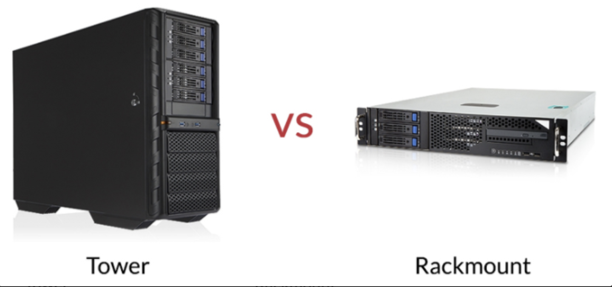
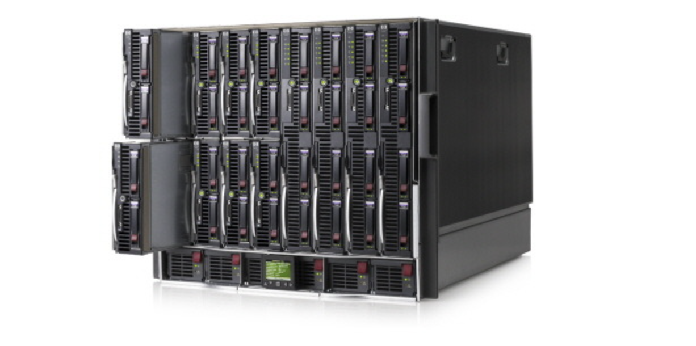

### 3. 서버 OS

#### 3종류의 서버 OS
- 서버 OS는 역사적인 변천을 제외하고 현재의 주류를 생각한다면, 다음 3가지로 요약된다.
  - Windows Server(마이크로 소프트가 대표격)
  - Linux(오픈소스 OS의 대표 격, 상용 OS로는 Red Hat등이 제공됨)
  - Unix 계열(서버 제조사들이 제공)
- 20년 전에는 UNIX 계열과 IT벤더 각 사의 독자적인 서버용 OS가 주류였지만,Windows PC와 Linux가 성장하면서 현재 상황에 이르렀다.
- 서버의 역사는 Unix로부터 시작된다.

#### 각 OS의 장점
- Windows Server는 서버용 OS지만, Windows PC와 같은 사용자 인터페이스로 조작할 수 있어 비교적 이해하기 쉽다.
- 또한, 기업이나 단체에서 필요로 하는 기능이 미리 패키지로 되어 있고 마이크로 소프트의 지원도 있다.
- Linux는 Windows로 말하면 명령 프롬프트 화면을 사용하는 사람이 아직 많지만, 최근에는 다양한 GUI툴이 이용된다.
- 무료 모듈이나 필요한 기능을 쌓아 가면 되기 떄문에, 비교적 간단하고 저렴하게 시스템을 구축할 수 있다.

#### 서버 OS의 과거와 현재
- UNIX
  - 1970~ : AT&T에서 개발되어 지금 형태가 됨(끝)
- Linux
  - 1980-1990 ~ : 리누스 토발스(Linus TOrvalds)가 UNIX를 참고하여 개발
- Windows
  - 1980-1990 : NT3.1을 발표
  - 2003 : Windows Server 사용 시작
- 서버용 OS는 클라이언트로부터 오는 동시 다수의 접속에 응답할 수 있는 성능을 가진다.
- Linux는 역사적 배경에서 UNIX 계열과의 친화성이 높다.
- UNIX계는 과거의 소프트웨어 자산 활용이나 장기간 연속 운용에 대응하는 서버 OS로써 현재에도 강력한 지지를 받고 있지만, 일반적인 이용 용도에서는 동등한 기능을 가진 Linux의 이용이 늘고 있다.

#### Point
- 현재 서버용 OS는 Windows, Linux, UNIX 계열의 3가지가 주류를 이룬다.
- 그중에서도 Windows Server와 Linux의 점유율이 높지만, 필요나 목적에 따라서 도입이 진행된다.

### 4. 서버의 사양

#### 서버의 기본 사양
- 자동차 사양의 경우 카탈로그를 보면 전장의 치수, 중량, 승차 정원, 엔진과 배기량, 변속디 등이 나와있다.
- 서버로 치면 CPU가 엔진에 해당할 것이다.
- 서버나 PC도 자동차처럼 기본적인 사양으로 형태와 크기, CPU수와 종류, 메모리 용량, 내장디스크 용량 등을 들 수 있다.
- 메모리나 디스크는 설치 가능한 수량, 용량과 함께 장착된 수량, 용량이 기재되는 것이 일반적이다.
- 이밖에도 여러 항목을 나열할 수 있지만, 서버에서 주의해야 할 것은 전원이나, 다중화 기구에 관한 항목이다.
- 대형서버는 많은 전력을 필요로 하므로 서버를 도입할 때 전원 공사가 필요한 경우가 있다.
- 서버 도입 현장에서는 서버를 구입해놓고 공사 준비가 되지 않아, 이용하지 못하는 일이 자주 있다.

#### 서버선정
- 서버 제조사나 판매 업체의 웹 사이트를 보면, 이전과 비교해서 서버를 고르기 꽤 쉬워졌다고 느껴진다.
- 예전에는 서버를 선택할 때 필요한 처리 성능이나 데이터양 등을 계산하고 서버 성능과 대조해서 선정했다.
- 하지만, 지금은 '사용자 수'나 '용도' 등으로 검토할 수 있다.
- 예를들어, "우리 부서의 50명이 이용하는 파일 서버"등의 정보가 있으면, 이누언수와 용도에 따라 조견표와 같은 형식으로 추천 서버가 제시되므로 그중에서 선택할 수 있다.
- 그만큼 서버가 우리 생활에 가까운 준재가 되기 시작했다는 말이다.

#### 서버 사양의 예
|항목|개별채용사양|
|--|--|
|형태, 크기|예 : 타워형, 랙 마운트형 등|
|CPU수, 종류|예 : 인텔XX, 1/2(최대 2개 설치 가능하고 현재 1개 설치)|
|메모리 용량|예 : 최대 3072GB|
|내장 디스크 용량|예 : 10/20TB|
|전원 유닛|예 : 250W, 300W, 450W 등|
|다중화 냉각패|예 : 유무|

#### 서버 선정
- 이전
  - 책상 위에서 성능을 평가해 서버를 선정했다
  - 성능평가 -> 서버선정
- 현재
  - 성능평가에 더해 사용자 수와 용도, 도입 사례 등을 검토하는 것이 주류가 되었다.
  - 성능평가 -> 사용자 수, 용도(서버의 제조사나 판매점 홈페이지게 게재) -> 도입 사례 -> 서버 선정
- 현재는 전문적인 지식을 가지고 있지 않아도 많은 사람들이 서버 선정을 할 수 있는 시대가 되었다.

#### Point
- 서버의 사양은 PC와 큰 차이는 없으나, 전원이나 다중화 장치는 체크한다.
- 최근에는 다양한 정보가 제공되고 있어, 전문적인 지식이 없어도 서버를 선정할 수 있게 되었다.
- 용도나 사용자 수 등으로 서버를 상상할 수도 있다.

### 5. 다양한 형태

#### 형태에 따른 종류
- 서버는 형태에 따라 주로 3가지로 나눌 수 있다.
- 타워
  - 데스크톱 PC와 같은 직육면체 모양으로 PC를 크게 만든 형태
- 렉 마운트
  - 전용 랙에 한대씩 설치하는 형태로 확장성과 내장애성이 뛰어나다.
  - 랙 안에서 숫자를 늘려 확장할 수 있고, 전용 랙으로 보호되므로 장애에도 강하다.
- 블레이드, 고밀도
  - 렉 마운트의 파생 형태이며, 주로 대량으로 서버를 이용하는 데이터 센터용 형태이다.
  - 공통 부품은 랙 쪽에 두고, 얇게 소형화된 서벌르 좁은 공간에 집중적으로 설치할 수 있게 되어 있다.
  - 집적률이 매우 높다는 특징이 있다.
- 타워형 서버와 랙마운트형 서버   

- 블레이드 서버

#### 그 밖의 형태
- 대형 컴퓨터의 메인 프레임이나 슈퍼 컴퓨터는 유닛별로 각각 전용 케이스를 갖고 있었다.
- 또한, CPU, 메모리, 디스크 등의 케이스가 분리되어 있다.
- 메인 프레임은 기업이나 단체에서는 정보 시스템 부서가 관리하는 전용 건물이나 층에 설치되는 것이 일반적이다.
- 정보 시스템 업무에 종사하지 않는 살마이 보기는 어려운 설비지만, 기회가 있으면 봐두는게 좋다.
- 사람 키보다 큰 케이스가 늘어선 광경은 압권이다.

#### Point
- 서버를 형태로 분류하면, 타워, 랙마운트 블레이드, 고밀도의 3가지 종류가 있다.
- 메인프레임이나 슈퍼컴퓨터 유닛마다 사람 키보다 큰 케이스에 나뉘어 늘어서 있다.