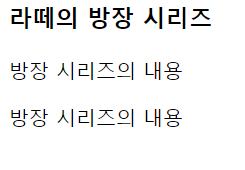

## HTML
### HTML기초
---
#### HTML이란?
- HyperText MarkUp Language라는 거창한 뜻이 있다.
- 하지만 대개 문서 취급을 받고 언어취급을 잘 못받는다.
- HTML은 태그라는 것들로 구성된다.
- 태그는 여러가지가 있고 디자인이나 기능을 결정하는데 사용된다.

#### 태그
- 시작태그과 종료태그가 존재한다.
- 아래와 같은 형태로 되어있다.
```
<태그명></태그명>
<h1></h1> //제목1
<h2></h2> //제목2
<br/> //다음행 개행 해당 태그는 하나로 이루어짐
```

### 기본구조
---
- HTML의 기본적인 구조는 아래와 같다.
```
<!DOCTYPE html>
<html lang="en">
<head>
    <title>Document</title>
</head>
<body>
    <h1>제목크기 1 태그</h1>
    <h2>제목크기 2 태그</h2>
    <p>단락 태그</p>
</body>
</html>
```
- ```<!DOCTYPE html>```는 현재 문서가 HTML문서임을 명시한다.
- ```<html>```는 HTML문서의 루트 요소를 정의한다.(최상위)
- ```<head>```는 HTML의 메타데이터(metadata)를 정의한다.
  - 메타 데이터란 HTML문서에 대한 정보로 웹 브라우저에는 직접적으로 표현되지 않는 정보를 의미한다.
  - ```<head>```안에 들어가는```<title>```은 문서의 제목을 정의하며 아래와 같은 용도로 사용된다.
    - 웹 브라우저의 툴바에 표시된다.
    - 웹 브라우저의 즐겨찾기(favorite)에 추가할 때 즐겨찾기에 제목이 된다.
    - 검색엔진의 결과 페이지에 제목으로 표시된다.
- ```<body>```는 웹 브라우저를 통해 보이는 내용(Content)부분이다
  - ```<body>```안에 들어가는 ```<h1>~<h6>```은 제목을 나타낸다.
  - ```<body>```안에 들어가는 ```<p>```는 단락을 나타낸다.

### HTML 요소 구조
- HTML요소(element)는 여러 속성을 가질 수 있다.
- 이러한 속성은 해당 요소에 대한 추가적인 정보를 제공한다.

```
<p class="클래스명">순게더</p>
p = 태그이름
class = 속성의이름
클래스명 = 속성값
순게더 = 내용
</p> = 종료태그
```
- 속성이름은 항상 소문자로 입력
- 속성값은 항상 따옴표로 감싼다
```
<p
style = "스타일명:스타일속성"
class = "클래스명"
id = "id명"
>

```

### HTML의 텍스트 요소
#### 제목
- HTML은 제목을 표현할 수 있는 다양한 크기의 <h> 태그를 제공한다.
- `<h1>` 부터 `<h6>`까지 존재하며 종료 태그가 존재한다.

```
예제

<h1>제목1의 크기입니다!</h1>
<h2>제목2의 크기입니다!</h2>
<h3>제목3의 크기입니다!</h3>
<h4>제목4의 크기입니다!</h4>
<h5>제목5의 크기입니다!</h5>
<h6>제목6의 크기입니다!</h6>
```


#### 단락
- 단락이란 내용상 끊어서 구분할 수 있는 하나한의 부분을 의미한다.
- HTML에서는 `<p>` 태그를 이용하여 단락을 표현한다.

```
<h3>라떼의 방장 시리즈</h3>
<p>방장 시리즈의 내용1</p>
<p>방장 시리즈의 내용2</p>
```



#### 띄어쓰기와 줄 나누기(br 태그)
- HTML에서는 띄어쓰기나 줄 나누기를 여러번 하더라도 브라우저를 통해 나타나는 화면에는 전혀 영향을 주지 못한다.
- `<br>`태그를 사용하면 새로운 단락을 만들지 않도록 줄을 나눌 수 있다.
- `<br>`태그는 종료태그가 없는 태그이다.

```
<h3>라떼의 방장 시리즈</h3>
<p>방장 시리즈의 내용1</p>
<br>
<p>방장 시리즈의 내용2</p>
```


#### 텍스트 서식 미리 정의(pre 태그)
- `<pre></pre>` 태그는 작성된 텍스트의 모든 띄어쓰기와 글나누기를 그대로 표현한다.

```
<pre>
라떼의 방장 시리즈

방장 시리즈의 내용1
방장 시리즈의 내용2
</pre>
```


- 다만 자주 쓰이지 않는 태그이다.

#### 가로 구분선 (hr 태그)
- `<hr>` 태그 역시 종료 태그가 없다
- 단락을 나눌 때 내용상의 구분을 표현하고자 수평 가로선을 그려준다.

```
<h3>라떼의 방장 시리즈</h3>
<hr>
<p>방장 시리즈의 내용1</p>
<br>
<p>방장 시리즈의 내용2</p>
```


- 구분선이 그어진 모습이다.