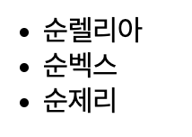
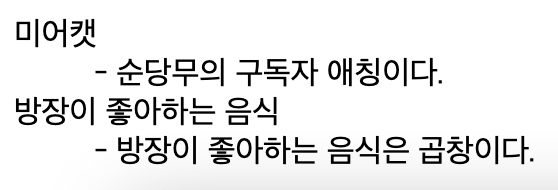

### 서식
- HTML은 텍스트(text)에 다양한 효과를 주는 여러 태그가 있다.

 

#### 강조 효과
#### `<b>` 와 `<strong>`
- HTML 문서에서 텍스트를 굵게 표현할 때 `<b>`(bold)태그 또는 `<strong>`태그를 사용하면 되고 둘다 종료 태그가 존재한다.
- `<b>`는 단순히 텍스트를 굵게해주지만, `<strong>`은 그 내용이 중요하다는 의미도 포함된다.
- 예제
```
   <!-- 강조효과 -->
   <p><b>안녕하세요 b태그를 사용하였습니다.</b></p>
   <!-- 강조효과 -->
   <p><strong>안녕하세요 strong태그를 사용하였습니다.</strong></p>
```


#### `<i>` 와 `<em>`
- HTML 문서에서 이탤릭체를 표현하고 싶을 때에는 `<i>`태그나 `<em>`태그를 사용한다.
- `<i>`는 단순히 화면을 이탤릭체로 표현해준다. `<em>`는 이탤릭체로 변환할 뿐만 아니라 그 내용이 중요하다는 의미도 포함한다.
- `<em>`과 `<strong>` 은 검색엔진이 강조된 텍스트를 더 중요하게 만들어준다.
- 예제
```
   <!-- 이탤릭체 -->
   <p><i>안녕하세요 i태그를 사용하였습니다.</i></p>   
   <!-- 이탤릭체 -->
   <p><em>안녕하세요 em태그를 사용하였습니다.</em></p>
```


#### `<del>`
- 텍스트 위에 가로줄을 보여준다.
- 예제
```
   <!-- 텍스트 가로줄 -->
   <p><del>안녕하세요 del태그를 사용하였습니다.</del></p>  
```


#### `<ins>`
- 텍스트 아래에 밑줄을 표시해준다.
```
   <!-- 텍스트 밑줄 -->
   <p><ins>안녕하세요 ins태그를 사용하였습니다.</ins></p>
```


#### 위 첨자와 아래첨자
- `<sup>`는 윗첨자
    - 윗첨자의 예 (제곱)
- `<sub>`는 아래첨자
    - 아래첨자의 예 (화학식 및 로그함수작성 시)
- 예제
```
   <!-- 위 첨자 -->
   <p>2<sup>2</sup>는 4이다</p>
   <!-- 위 첨자 -->
   <p>log<sub>2</sub>4는 2이다</p>
```


#### `<q>`
- 인용구로 사용되며 사용시 시작태그부터 끝 태그까지 따옴표가 붙는다.
- 예제
```
   <p><q>안녕하세요</q></p>
```


#### `<blockquote>`
- 블록 인용구로 사용되며 별도의 단락을 들여쓰기를 한다.


#### `<abbr>`
- 축약형 표현으로 사용되며 마우스를 올려놓으면 title에 세팅된 값이 보여진다.

```
사용
<abbr title = "방장공부하자시리즈">방장</abbr>

이때 출력되는 방장을 마우스로 올리면 방장공부하자 시리즈가 나옴
```


#### `<address>`
- 주소를 표현할 수 있으며 이탤릭체로 표시된다.
- 위 아래로 공백이 자동으로 삽입된다.

 

#### `<!-- -->`
- 주석으로 사용된다.
- `<!---주석내용-->` 으로 사용된다.
- 주석안에 주석을 추가할 수 있다.

```
<!---한줄로 사용할 수 있다. -->

<!--

    여러줄로
    사용할
    수 있다.
    <!-- 주석을 더 추가해 보았다. -->

-->
```
### 엔티티
- HTML에는 미리 예약된 몇몇 문자가 있으며, 이러한 문자를 HTML 예약어라고 부른다.
- 이러한 HTML예약어를 HTML 코드에서 사용하면, 웹 브라우저는 그것을 다른 것으로 해석한다.
- 예시
```
&lt == < //로 작성된다

&gt == > //로 작성된다.
```
- HTML에서 제공하는 대표적 엔티티

|엔티티문자|엔티티이름|16진수엔티티숫자|설명
|---|---|---|---|
| 	|`&nbsp;`|`&#160;`|줄 바꿈 없는 공백
|<	|`&lt;`|`&#60;`|보다 작은|
|>	|`&gt;`|`&#62;`|보다 큰|
|&	|`&amp;`|`&#38;`|AND 기호|
|"	|`&quot;`|`&#34;`|큰따옴표|
|'	|`&apos;`|`&#39;`|작은따옴표|

### 문자 셋
- 웹 브라우저가 HTML문서를 정확하게 나타내기 위해 해당 문서가 어떠한 문제셋으로 저장되었는지를 알아야 한다.
- 따라서 HTML문서가 저장될 때 사용된 문자셋에 대한 정보를 `<head>`태그 내의 `<meta>` 태그에 명시한다.
- 예시
```
//HTML4에서 UTF-8을 사용하는 경우
<meta http-equiv="Content-Type" content="text/html;charset=UTF-8">

//HTML5에서 UTF-8을 사용하는 경우
<meta charset="UTF-8">
```

#### 문자셋의 종류
- ASCII : 가장 처음 만들어진 문자셋으로, 인터넷에서 사용할 수 있는 127개의 영문자와 숫자로 이루어져 있습니다.
- ANSI : 윈도우즈에서 만든 문자셋으로, 총 256개의 문자 코드를 지원합니다.
- ISO-8859-1 : 256개의 문자 코드를 지원하는 HTML4의 기본 문자셋입니다.
- UTF-8 : 세상에 있는 거의 모든 문자를 표현할 수 있는 유니코드 문자를 지원하는 HTML5의 기본 문자셋입니다.

### 링크 `<a>`
- 다른 페이지나 다른 사이트로 연결되는 수많은 하이퍼링크가 존재한다.
- 이러한 하이퍼 링크를 간단히 링크(link)라 부르며, HTML에서는 `<a>`로 표현한다.
- a 태그의 어원은 ancher(닻, 출처 : 생활코딩)
- `<a>`태그의 href 속성은 링크를 클릭하면 연결할 페이지나 사이트의 URL 주소를 명시한다.
- `<a>`태그는 텍스트나 단락, 이미지 등 다양한 HTML 요소에 사용할 수 있다.
```
예제
<a 
href="링크의 주소"
target=""
>링크 클릭</a>
```
- target 속성
  - 링크에 연결된 문서를 어떻게 열지를 명시한다.
  
|target 속성값|설명|
|--|--|
|_blank|링크로 연결된 문서를 새 창이나 새 탭에서 오픈.|
|_self|링크로 연결된 문서를 현재 프레임(frame)에서 오픈. (기본설정)|
|_parent|링크로 연결된 문서를 부모 프레임(frame)에서 오픈.|
|_top|링크로 연결된 문서를 현재 창의 가장 상위 프레임(frame)에서 오픈.|
|프레임(frame)이름|링크로 연결된 문서를 지정된 프레임(frame)에서 오픈.|

```
//blank
<h2>
  <a href="/html/intro" target="_blank">blank</a>
</h2>

//self
<h2>
  <a href="/html/intro" target="_self">self</a>
</h2>

//parent
<h2>
  <a href="/html/intro" target="_parent">parent</a>
</h2>

//top
<h2>
  <a href="/html/intro" target="_top">top</a>
</h2>

//myframe
<h2>
  <a href="/html/intro" target="myframe">myframe</a>
</h2>
```

### 이미지 ``
- 이미지 삽입을 위한 태그
- 예제
```
- 통상적으로 사용되는 예제입니다.

```
- src 즉 이미지의 경로는 디스크 내부 경로를 사용해도 되며 인터넷에서 돌아다니는 주소의 경로로 사용해도 된다.

```
예제
로컬 파일을 가져오는 예


인터넷에 등록된 이미지 주소로 가져오는 예

```
- md 파일에서도 적용됩니다.
- 로컬 파일 불러오기 예


- 인터넷에 등록된 이미지 주소로 가져오는 예
- 구글에 돌아다니는 방장 이미지를 가져왔습니다.
 


<br>

### 리스트 
- 리스트(list)란 여러 요소들을 일렬로 나열한 목록이나 명단을 의미
- HTML에서는 이러한 리스트를 표현하기 위해 다음과 같은 리스트를 제공
- 리스트는 3가지로 분류된다
  1. 순서가 있는 리스트
    - 예제
  ```
  <ol>
    <li>첫번째 순당무</li>
    <li>두번째 순당무</li>
    <li>세번쨰 순당무</li>
  </ol>
  ```


  - 순서가 있는 리스트의 마커(1, 로마자1 등)는 다음처럼 변경할 수 있다.
  ```
  //영문 대문자로 적용
  <ol style="list-style-type: upper-alpha">
    <li>첫번째 순당무</li>
    <li>두번째 순당무</li>
    <li>세번쨰 순당무</li>
  </ol>
  ```


  - decimal : 숫자 (기본설정)
  - upper-alpha : 영문 대문자
  - lower-alpha : 영문 소문자
  - upper-roman : 로마 숫자 대문자
  - lower-roman : 로마 숫자 소문자
  

2. 순서가 없는 리스트
 - 예제
  ```
  <ul>
    <li>순렐리아</li>
    <li>순벡스</li>
    <li>순제리</li>
  </ul>
  ```
  
  
    - 순서가 없는 리스트의 마커는 다음의 형태로 바꿀 수 있다.
  
  ```
  //흰색 작은 원모양으로 적용
  <ul style="list-style-type: circle">
    <li>순렐리아</li>
    <li>순벡스</li>
    <li>순제리</li>
  </ul>
  ```

  

    - disc : 검정색 작은 원 모양 (기본설정)
    - circle : 흰색 작은 원 모양
    - square : 사각형 모양

  - 정의 리스트
    - 예제
  ```
  <dl>
    <dt>미어캣</dt>
    <dd>- 순당무의 구독자 애칭이다.</dd>
    <dt>방장이 좋아하는 음식</dt>
    <dd>- 방장이 좋아하는 음식은 곱창이다.</dd>
  </dl>
  ```

  