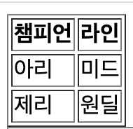
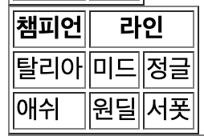
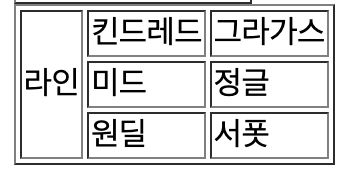
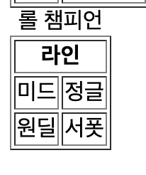
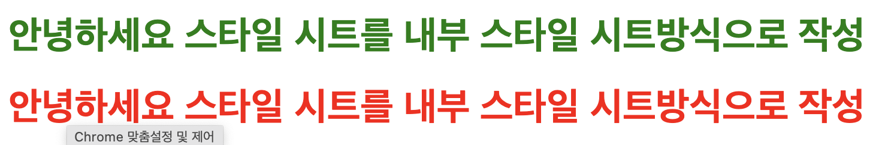

### 테이블
- HTML 테이블이란 여러 종류의 데이터를 보기 좋게 정리하여 보여주는 표
- 엑셀, 한글 표 등의  스프레드 시트 데이터와 동일하다고 보면됨

#### 테이블의 구성

- 주 사용 태그는 `<table>`, `<td>`, `<tr>` 태그이다.
- 상위에 table 태그 1차 하위에 tr 태그, 2차 하위에 td태그가 들어간다고 보면 됨
- td태그 안에는 입력할 수 있는 모든 데이터가 들어가며 해당 데이터는 table 태그도 포함된다.
- 구성 예제
```
//항상 table 태그로 시작합니다.
<table>
//tr은 테이블의 열을 구분한다
  <tr>
    //th는 각 열의 제목을 나타내며 굵게 표시 및 가운데정렬을 한다
    <th></th>
    
  </tr>
  <tr>
    //td는 각각의 열을 셀로 나뉜다.
    <td></td>
  </tr>  
</table>

<table>
  <tr>
    <th>챔피언</th>
    <th>라인</th>
  </tr>
  <tr>
    <td>아리</td>
    <td>미드</td>
  </tr>
  <tr>
    <td>제리</td>
    <td>원딜</td>
  </tr>      
</table>
```


#### 테이블 행, 열 합치기
- colspan, 속성과 rowspan 속성은 각각 행, 열을 합칠 수 있다.
- 열을 합치는 예제
```
<table border="1">
  <tr>
    <th>챔피언</th>
    <!-- 열을 합칠때 사용하는 colspan -->
    <th colspan="2">라인</th>
  </tr>
  <tr>
    <td>탈리아</td>
    <td>미드</td>
    <td>정글</td>
  </tr>
  <tr>
    <td>애쉬</td>
    <td>원딜</td>
    <td>서폿</td>
  </tr>      
</table>
```



- 행을 합치는 예제
```
<table>
  <tr>
    <th colspan="2">라인</th>
  </tr>
  <tr>
    <td>미드</td>
    <td>정글</td>
  </tr>
  <tr>
    <td>원딜</td>
    <td>서폿</td>
  </tr>      
</table>
```



#### 캡션
- `<caption>`태그를 사용하면 테이블 상단에 제목이나 짧은 설명을 붙일 수 있다.
- 예제
```
<table>
  <caption>롤 챔피언</caption>
  <tr>
    <th colspan="2">라인</th>
  </tr>
  <tr>
    <td>미드</td>
    <td>정글</td>
  </tr>
  <tr>
    <td>원딜</td>
    <td>서폿</td>
  </tr>      
</table>
```
- 놀랍게도 이게 캡션입니다.



## CSS(Cascading Style Sheets)
- 웹페이지의 스타일과 내용적인 부분을 서로 분리해 놓은 서식을 스타일 시트라고 한다.
- css요소는 엄청 많은 요소들을 가지고 있습니다. 따라서 전부다 정리하기엔 본 취지(css 간단한 개념 이해)에는 맞지 않기 때문에 해당 정리본에는 간단한 문법 및 사용법만 정리할 예정입니다.
- 너무 간단하게 작성하여 죄송스럽게 생각하고 추가 설명 및 요소가 궁금하신 분들은 참조 사이트 올려드리겠습니다.

### CSS의 적용법
- CSS의 작성법은 3가지로 구분이 된다.
- 인라인 스타일, 내부 스타일 시트, 외부 스타일 시트로 구분된다.
- 인라인 스타일
  - html의 태그 안에서 작성하는 방식이다. 태그 속성(HTML1 태그의 속성 작성법 확인하기.)에 style 속성을 추가함으로 작성할 수 있다.
  - `<a style = "속성 : 속성값; 속성2 : 속성값2;">`등의 방식으로 작성된다.
  - 예제
  ```
    <h1 style = "color : green;"> 안녕하세요 스타일 시트를 인라인방식으로 작성</h1>
    <h1 style = "color : red;"> 안녕하세요 스타일 시트를 인라인방식으로 작성</h1>
  ```

  

- 내부 스타일 시트
  - html요소 중 head 태그 내 style이란 태그로 css스타일을 적용하는 방법이다.
  - 아래와 같이 작성할 수 있다. 
  ```
  <!--head 태그 안-->
  <style>
    h1{
      /*해당 속성은 글자 색을 바꾸는 속성*/
      color : green;
    }
    /*뒤에서 설명할 선택자를 이용한 작성법*/
    #a{
      color : red;
    }
  </style>
  <body>
    <h1>안녕하세요 스타일 시트를 내부 스타일 시트방식으로 작성</h1>
    <h1 id = "a">안녕하세요 스타일 시트를 내부 스타일 시트방식으로 작성</h1>
  </body>
  ``` 


- 외부 스타일 시트
  - 스타일 시트 파일을 생성하여 웹사이트 전체의 스타일을 하나의 파일에서 변경할 수 있게 해준다.
  - 스타일 시트 파일은 .css 확장자로 저장된다.
  - `<head>` 태그 내 `<link>`태그를 이용하여 불러올 수 있다.
  - 예제
  ```
    <head>
      <!-- rel은 stylesheet뿐만 아니라 다른 것도 들어갈 수 있습니다.
      현재는 stylesheet임을 의미하게 함 -->
      <!-- 경로 입력 시 ./는 현 위치 폴더를 의미합니다. -->
      <link rel="stylesheet" href="./style.css">
    </head>
    <body>
      <h1 id="a">안녕하세요 스타일 시트를 외부 스타일 시트방식으로 작성</h1>
    <h1 class = "a">안녕하세요 스타일 시트를 외부 스타일 시트방식으로 작성</h1>
    </body>
  ```


### CSS문법
- css는 항상 특정 선택자에 어떤 속성을 어떤 속성값으로 부여할 것인가를 중심으로 선언한다.
- 예제
```
a {background-color: yellow; font-size:16px;}
a : 선택자
background-color, font-size : 속성명
yellow, 16px : 속성 값
;(세미콜론) : 선언 끝
```
- 선택자의 요소는 다음과 같다.
- html 요소(태그), 아이디(id), 클래스(class), 그룹(group)
- html 요소(태그)
  - 태그의 경우 `<a>`형태로 구성되어있다. 따라서 별다른 구분자를 주지 않는다.
  - 예제
  ```
    a{
      속성: 속성값;
    }
  ```
- 아이디(id)
  - 태그는 태그 내부에 속성값(속성값 부여하는 법 HTML1 참조)으로 id명을 부여할 수 있다.
  - `<a id = "an">`
  - 해당 id는 수많은 a태그중 an이름을 가진 id로 분류된다.
  - 되도록이면 태그명을 구분할 수 있게 이름을 정하는 것이 좋다.
  - 따라서 css에서 id명 부여 시 아래와 같이 작성할 수 있다.
  ```
    #an{
      속성:속성값;
    }
  ```
  - id명 앞에 #을 입력하여 id 속성값이라는 것을 구분한다.

- 클래스(class)
  - id와 동일하게 태그 내부에 속성값으로 class를 부여할 수 있다.
  - `<a class = "an">`
  - 해당 클래스명은 수많은 a태그중 an이름을 가진 class로 분류된다.
  - id와 마찬가지로 태그명을 구분할 수 있게 이름을 정하는 것이 좋다.
  - 다만 id와 다른 점은 class는 이름 부여시 여러개를 부여할 수 있다는 것에서 차이가 있다.(id는 1개의 이름만 부여 가능)
  - `<a class = "an an1 an2">` 등으로 3개의 클래스명 부여
  - 따라서 css에서 class명 부여시 아래와 같이 작성한다.
  ```
   .an{
    속성: 속성값;
   }
   .an1{
    속성: 속성값;
   }
  ```
- 그룹 선택자
  - 그룹 선택자는 태그, id, class처럼 별다른 구분을 두는 것이 아닌 여러 선택자를 같이 사용하고자 할 때 사용된다.
  - 예제
  ```
    /*이런식으로 입력 시 a태그와 an이름을 가진 id,
    an이름을 가진 클래스의 변경이 이루어진다.*/
    a, #an, .an{
      속성 : 속성값;
    }
  ```

### css의 주석
- `/* 작성할 주석 이름 */`으로 작성한다.


### Form 태그 설명전 간단한 통신법 이해
- 원래대로면 javascript설명을 한 후 진행하는 것이 이치에 맞지만, `<form>`태그의 복합적인 요소(설명할게 너무 많음)로 인해 브라우저와 웹서버 통신방법 먼저 설명하고자 한다.(추가 설명은 추후에 추가할 예정)
- 주로 사용하는 1달전 고인이된 Internet Explorer, 죽은 IE의 뒤를 이은 크롬 기반 MS Edge, 구글의 Chrome, 네이버의 웨일 등 인터넷을 접속하기 위헤 사용하는 것들을 "웹 브라우저"라고 한다.
- 일반적인 사람들은 브라우저를 실행시켜 주소창에 원하는 사이트를 입력하여 해당 사이트를 접속하는 방식으로 사용하고 있다.

#### 웹 브라우저와 웹 서버의 통신
- 먼저 웹 브라우저와 웹 서버라는 개념부터 설명하겠다
  - 웹 브라우저 : 인터넷 통신을 하는 IE, Edge , Chrome, 웨일등
  - 웹 서버 : 웹 브라우저에서 요청을 하는 대상 서버
    - 쉽게 생각하면 일반적으로 사용하는 naver, daum, op.gg, fow.kr 등 각종 사이트들은 하나의 웹서버 혹은 서버라고 생각하면 된다.
- 사진출처 : 생활코딩


- 우리가 www.naver.com을 입력하면 네이버라는 사이트에 접속된다는 것을 두눈으로 확인할 수 있을것.
- 그럼 어떻게 네이버라는 사이트에 들어가게 되는걸까?
- 먼저 주소창에 www.naver.com 를 입력하여 엔터를 클릭등의 방법으로 접속하는 것을 네이버 사이트를 가지고 있는 웹서버로부터 웹 브라우저가 하는 행위라고 하며 이를 "요청"(request)이라고 한다.
  - 추가 설명을 하자면 통상적으로 www앞에 `http://` 혹은 `https://`를 주소창에 같이 입력할때도 있고, 안할때도 있다.
  - 이것은 브라우저가 www앞에 http를 굳이 입력하지 않아도 알아서 http로 요청을 한다고 생각하면 된다. 
  - http를 간단하게 설명하면 본 설명문에서 설명하고 있는 html, css등 파일을 송수신하기 위해 사용하고 있는 통신 프로토콜(통신 규약)이라고 할 수 있다.
  - (하지마라)간단한 예시를 설명하면 순당무님의 방송에서 도네이션을 하기 위해서는 트윕 혹은 투네이션의 방식(http방식)을 사용한다. 라는 것과 돈을 보내면(http 요청) 순당무님이 방송에서 받은 도네이션을 확인하여 리액션을 하는(http 응답) 일종의 방식 혹은 약속이라고 생각하면 된다.
  - https는 보안파트에서 잠깐 언급했지만 http를 사용하는 사이트의 위변조 공격 위험을 예방하고자 기존 http에 보안인증서(공개키 방식)를 추가하여 외부로부터 공격에 대비한 방식이라고 생각하면 된다.
- 이런 요청 작업을 진행하면 www.naver.com 주소로 세팅이 되어있는 웹서버가 해당 주소를 요청하였을 때 네이버의 화면들을 보여지기 위한 html, css, javascript, image등 파일을 브라우저로 업로드(이때 해당 파일을 보내는 행위자는 웹서버이기 때문에 업로드라는 표현 사용)를 하여 브라우저에 세팅되는 행위가 응답이라고 생각하면 된다.

- 정리하면
```
웹 브라우저가 웹서버에 웹페이지를 달라고 하는 것 : 요청(request)
요청한 웹페이지를 웹브라우저에 제공하는 것 : 응답(response)
```
