### Form
- 웹페이지에서 form태그 및 요소를 사용하여 사용자로부터 입력을 받을 수 있다.
- 우리가 인터넷에서 사용하는 아이디 비밀번호 입력, 게시글 쓰기, 덧글 쓰기 전부 Form으로 입력을 받는 것이라고 생각하면 쉽다.
- form태그를 사용함으로 얻어지는 효과는 다음과 같다.
  - 브라우저는 사용자가 요구한 요청에 따른 입력이 가능하게 한다.
  - 데이터 전달을 이용하여 웹서버에 구축된 데이터베이스에 데이터 저장이 가능하게 한다.
  - 기타 등등
- form 태그의 사용 예시
```
<form action="처리할 페이지 주소" method="get|post"></form>
``` 
- action 속성은 입력받은 데이터를 처리할 서버 상의 스크립트 파일의 주소를 명시한다.
- 전달받은 데이터를 처리하는 스크립트 파일을 폼 핸들러(form-handler)라고 한다.
- method 속성은 입력받은 데이터를 서버에 전달하는 방식을 명시한다.
- 따라서 사용자가 form 요소를 통해 입력한 데이터는 action 속성에 명시된 위치로 method 속성의 방식을 통해 전달된다.

### method 속성
- method 속성을 통해 명시할 수 있는 form 요소의 전달 방식은 GET방식과, POST방식으로 나뉜다.

#### GET방식
- 주소에 데이터를 추가하여 전달하는 방식
- 데이터가 주소 입력창에 그대로 나타나며 전송할 수 있는 데이터의 크기 또한 제한적
- 검색 엔진의 쿼리(query)와 같이 크기가 작고 중요도가 낮은 정보를 보낼 때 주로 사용된다.
- 다만 GET방식의 경우 요청 데이터를 요청 주소 뒤에 그대로 넘기는 방식이기 때문에 데이터가 암호화되지 않아 공격의 우려가 있다.
- 예시 (사진은 순당무 트게더를 구글에 검색하였을 때 주소창 상황입니다.)

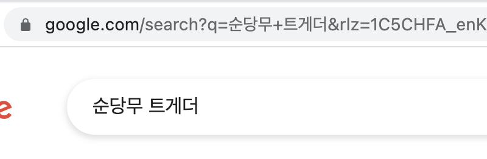

#### POST
- 데이터를 별도로 첨부하여 전달하는 방식.
- 데이터가 외부에 드러나지 않으며, 전송할 수 있는 데이터의 크기 또한 제한이 없다.
- 보안성 및 활용성이 GET방식보다 높다
- 주로 HTTP 통신 시 JSON이라는 데이터를 넘길떄 POST방식을 사용한다.


#### 다양한 타입의 input 요소
- HTML에서는 다양한 타입의 `<input>` 요소를 사용하여 사용자로부터 입력을 받을 수 있다.
- 대표적 input 요소는 다음과 같다.
  - 텍스트 입력
  - 비밀번호 입력
  - 라디오 버튼
  - 체크박스
  - 파일 선택
  - 선택 입력
  - 문장 입력
  - 버튼 입력
  - 전송 버튼
  - 필드 셋

1. 텍스트 입력
   - `<input>`태그의 type 속성값을 "text"로 설정하면, 사용자로부터 한 줄의 텍스트를 입력받을 수 있다.
  ```
    <form>
      <input type="text" name = "search">
    </form>
  ```

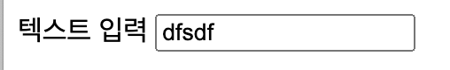

2. 비밀번호 입력
   - `<input>`태그의 type 속성값을 "password"로 설정하면, 사용자로부터 한 줄의 패스워드 형테의 데이터를 입력받을 수 있다.
   - 입력 시 별표 혹은 작은 원모양이 표시된다.
  ```
    <form>
      <input type="password" name = "passwd">
    </form>
  ```
  

3. 라디오 버튼
   - `<input>`태그의 type 속성값을 "radio"로 설정하면, 사용자로부터 여러개 옵션(option)중에서 단 하나의 옵션만을 입력받을 수 있다
   - 이떄 서버로부터 정확한 입력을 전송하기 위해서는 radio 요소의 name 속성이 같아야 한다.
  ```
    <form>
      <input type="radio" name = "radio_group" value = "jerry" checked>제리
      <br>
      <input type="radio" name = "radio_group" value = "kaisa">카이사      
    </form>
  ```  
  - checked 속성을 입력하여 미리 선택되는 옵션을 지정할 수 있다.
  - 추가 설명을 하면 라디오 버튼으로 체크한 대상의 데이터는 value값으로 설정하면 된다 예를들면 제리를 선택하였을 때 실제 라디오버튼의 데이터는 value에 세팅된 jerry 이다.
  
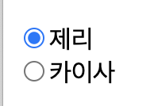 

4. 체크박스
   - `<input>`태그의 type 속성값을 "checkbox"로 설정하면, 사용자로부터 여러개 옵션(option)중에서 단 하나의 옵션만을 입력받을 수 있다
   - 라디오 버튼과 다른점은 여러개 옵션을 한번에 입력받을 수 있다는 것.
   - 이떄 서버로부터 정확한 입력을 전송하기 위해서는 checkbox 요소의 name 속성이 같아야 한다.
  ```
    <form>
      <input type="checkbox" name = "lolchamp" value = "jerry" checked>제리
      <br>
      <input type="checkbox" name = "lochamp" value = "kaisa" disabled>카이사      
    </form>
  ```  
  - checked 속성을 입력하여 미리 선택되는 옵션을 지정할 수 있다.
  - disabled 속성을 사용하여 해당 옵션을 선택할 수 없게 할 수 있다.

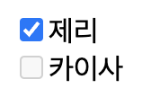 

5. 파일선택
   - `<input>`태그의 type 속성값을 "file"로 설정하면, 사용자로부터 파일을 전송 받을 수 있다.
  ```
    <form>
      <input type="file" name = "upload_file" accept = "image/*">
      <br> 
    </form>
  ```  
  - accept 속성을 이용하여 입력받을 수 있는 파일의 확장자 및 종류를 명시할 수 있다.

6. 선택 입력
   - `<select>` 요소는 여러개의 옵션이 드롭 다운 리스트로 되어 있으며, 그 중에서 단 하나의 옵션만을 입력받을 수 있다.
   - `<option>` 요소는 드롭다운 리스트에서 선택할 수 있는 각각의 옵션을 명시한다.
  ```
    <select name = "fruit">
      <option value="apple"> 사과
      <option value="orange" selected> 귤
      <option value="strawberry"> 딸기
      <option value="peach"> 복숭아

    </select>
  ```
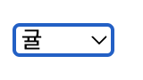 

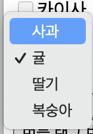 

7. 문장 입력
  - `<textarea>` 요소는 사용자로부터 여러줄의 텍스트를 입력받을 수 있다.
  ```
  <textarea name="message" rows="5" cols="30">
    여기에 적으세요.
  </textarea>
  ```
  - rows 속성과 cols 속성을 이용하여 textarea 요소의 크기를 자유롭게 지정할 수 있다.

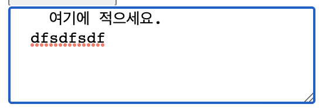 

8. 버튼
  -  요소는 사용자가 누를 수 있는 버튼을 나타낸다.
  -  특이하게 2가지 방법이 존재한다.
     -  `<input>`에서 type을 button으로 지정하기
     -  `<button>`태그를 사용하는 방법
  ```
  예제
  <input type = "button" value = "type 버튼">
  <button>버튼 태그 버튼</button>
  ```
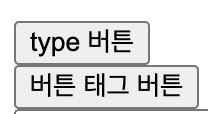 

9. 전송 버튼
  - `<input>` 태그의 type 속성값을 "submit"으로 설정하면, 사용자로부터 입력받은 데이터를 서버의 폼 핸들러로 제출하는 버튼을 생성한다.
  - 폼 핸들러란 위에서도 설명했지만 입력받은 데이터를 처리하기 위한 서버 측의 웹 페이지를 의미한다.
  ```
  <form action="전송할 주소">
    form 테스트 : <br>
    <input type="text" name="nickname" value="별명"><br><br>
    <input type="submit" value="전송">
  </form> 
  ```
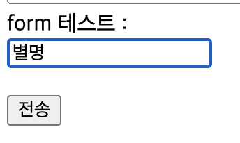 

10. 필드 셋
  - `<fieldset>` 태그는 form 요소와 관련된 데이터들을 하나로 묶어주는 역할을 한다.
  - `<legend>` 요소는 fieldset 요소 안에서만 사용할 수 있으며, field 요소의 제목을 나타낸다.
  ```
  <form action="전송할 주소">
    <fieldset>
        <legend>입력 양식</legend>
        이름 : <br>
        <input type="text" name="username"><br>
        이메일 : <br>
        <input type="text" name="email"><br><br>
        <input type="submit" value="전송">
    </fieldset>
  </form> 
  ```   
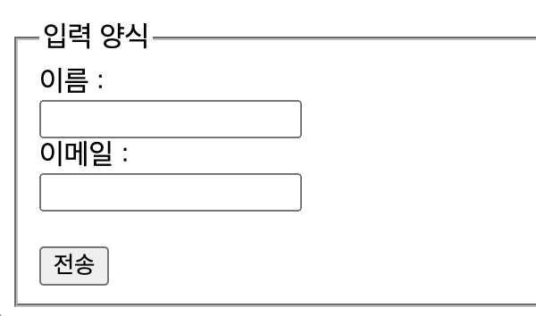 

### `<input>` 태그에서 사용하는 속성들
#### input 요소의 속성
- input 요소의 속성을 사용하면 사용자가 입력하는 방식을 더욱 다양하게 제어할 수 있다.
1. value 속성
   - value 속성은 input 요소의 입력필드에 나타나는 초깃값을 설정한다.
  ```
   예시
   <form>
    학과 : <br><input type="text" name="department" value="컴퓨터공학과"><br>
    </form>
  ```
2. readonly 속성
   - readonly 속성은 사용자가 입력필드를 볼 수는 있으나, 수정할 수 없도록 설정
   - disabled 속성과 다른 점은 전송 버튼을 누르면 처음 세팅된 초기값이 서버로 전송된다는 점
  ```
   예시
   <form>
    학과 : <br><input type="text" name="department" value="컴퓨터공학과" readonly><br>
   </form>
  ```
3. maxlength속성
   - maxlength 속성은 입력 필드에 입력할 수 있는 문자의 최대 길이(length)를 설정한다.
  ```
  <form>
    학과 : <br><input type="text" name="department" value="컴퓨터공학과" maxlength="10"><br>
   </form>
  ```
4. size
   - size 속성은 입력 필드에 보여지는 input 요소의 크기 (size)를 설정한다.
   - maxlength 속성과 달리 입력 필드에 한번에 보여줄 수 있는 문자의 최대 개수만을 의미한다.
  ```
  <form>
    학과 : <br><input type="text" name="department" value="컴퓨터공학과" maxlength="10" size = "30"><br>
   </form>
  ```

## JAVASCRIPT
- HTML, CSS의 추가적인 설명은 새로운 내용이 나올 떄 마다 정리하도록 하겠습니다.
- Javascrip는 객체 기반의 스크립트 언어이다.
- HTML로는 웹의 내용을 작성(뼈대를 작성) CSS로는 웹을 디자인(살을 붙여 형태를 갖춤), JAVASCRIPT로는 웹의 동작(형태를 갖춘 요소가 행동을 함)을 구현할 수 있다.
- 파이썬과 같은 인터프리터 언어로 별도의 컴파일 없이 인터프리터가 스크립트를 한줄한줄 읽어 내리는 방식으로 동작한다고 보면 된다.
- 웹 브라우저에는 기본적으로 자바스크립트 인터프리터가 내장되어있다.
- 본 정리본은 간단한 문법만 정리 할 예정입니다.

### 자바 스크립트의 특징
- 객체 기반 스크립트 언어이다.
- 동적이며, 타입을 명시할 필요가 없는 인터프리터 언어이다.
  - 자바스크립트 다음버전인 타입스크립트부터 타입을 명시함
- 객체 지향형 프로그래밍과 함수 지향형 프로그래밍 모두 표현할 수 있다.
  - 쉽게말해 자바에서 사용하는 class도 사용이 가능하고 통상적인 active를 사용할 때 함수 호출이 잦다.
- 빠르게 문법을 알아보자

### 자바 스크립트 작성법
- 자바스크립트 작성법은 css와 다르게 2가지가 존재한다.
1. 내부 자바스크립트 코드로 적용하는 법
  - HTML문서 안에 작성하는 방식이다.
  - 문서 내 `<head>` 태그와 `<body>`태그 안에 `<script>`태그를 적용하여 자바스크립트를 적용하면된다.
  - 예시
  ```
    //head 태그 안
      <head>
        <script>
          function a(){
              alert("hello world");
          }
        </script>
      </head>
    //body 태그 안
    <body>
      <p>
        안녕하세요
      </p>
      <script>
        function a(){
          alert("hello world");
        }
      </script>
    </body>
  ```
2. 외부 자바스크립트 파일 입력하는 법
  - 자바스크립트는 파일로 따로 관리할 수 있다. 이때 파일 확장자는 .js파일을 이용한다.
  - `<script>`태그 안에 src 속성을 추가하여 js 파일을 추가할 수 있다.
  ```
  //예시
  //hello.js
  function ab(){
    //alert는 브라우저에 출력되는 알림창 입니다.
    alert("hello world");
  }
  //20220709.html
  <head>
    <script src="./hello.js">
  </head>
  ```

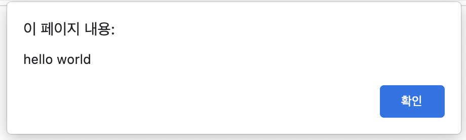 

### 기본 타입
- 언어를 공부하면 항상 딸려오는 타입이다.
- 자료형이라고도 불리며 자바스크립트는 타입 명시가 기본적으로 필요 없이 var를 앞에 붙여 선언한다.
- 다만 파이썬처럼 초기화한 값에 따라 자동으로 타입 지정이 된다.
- 자바스크립트는 여러가지 형태의 타입을 미리 정의하여 제공하며 이를 기본 타입이라고 부른다.
- 자바스크립트의 기본 타입은 원시 타입과 객체 타입으로 구분된다.
- 원시타입은 아래와 같다
```
1. 숫자(number)
2. 문자열(string)
3. 불리언(boolean)
4. 심볼(symbol) : ECAMScript 6 부터 사용
5. undifined
```
- 객체 타입은 다음과 같다.
```
6. 객체
```
```
  var num = 10; //숫자
  var myName = "홍길동" //문자열
  var str; //undefined
```

#### 숫자
- 자바스크립트는 모든 수를 실수로 표현한다.
- 매우 큰 수나 작은 수를 표현할 때는 e표기법을 사용할 수 있다.
```
  var num = 10;//소수점을 사용하지 않음
  var num2 = 10.11;//소수점 사용
```

#### 문자열
- 자바스크립트에서 큰따옴표("")나 작은따옴표('')로 둘러싸인 문자의 집합을 의미한다.
- 큰따옴표는 작은 따옴표로 둘러싸인 문자열에만 포함이 도며, 작은 따옴표는 큰 따옴표로 둘러싸인 문자열에만 포함된다.
```
var str_ex1 = "문자열이다";
var str_ex2 = '이것도 문자열이다.';
var str_ex3 = "'얘'를 포함하는 문자열이다.";
var str_ex4 = '"얘"를 포함하는 문자열이다.';
```
- 자바스크립트에서는 숫자와 문자열을 더할 수 있다. 이경우 숫자+문자는 문자열로 변환하여, 두 문자열을 연결하는 연산을 수행한다.
```
var num = 10;
var str = "javascript"
console.log(num + str);
```

#### boolean 불리언
- 불리언 값은 참(true)과 거짓(false)을 표현한다.
- 자바스크립트에서 불리언값은 예약어인 true와 false를 사용하여 나타낼 수 있다.
```
var firstNum = 10;
var secondNum = 11;
console.log(firstNum == secondNum);
```

#### null과 undefined
- 자바스크립트에서 null이란 object타입이며, 값이 정해지지 않은 것을 의미한다.
- undefined란 null과 달리 타입이 정해지지 않는 것을 의미한다.
- 따라서 undefined는 초기화되지 않은 변수나 존재하지 않는 값에 접근할 때 반환된다.

```
var num; //초기화 되지 않는 값은 undefined
var str = null; //object 타입의 null 값
```
#### 객체
- 자바스크립트의 기본 타입이다.
- 객체는 여러 프로퍼티나 메소드를 같은 이름으로 묶어놓은 일종의 집합체이다.

```
var bangjang = {
  line : ["support","mid"],
  broadcasting_career : "3",
}
console.log("방장의 주 라인은" + bangjang.line[0] +
"과" + bangjang.line[1]+"이 되겠습니다. 방송경력은" + 
bangjang.broadcasting_career + "년 입니다.");
```

#### chrome에서 테스트 방법
- 본 강의에서 사용하는 테스트 방법이다.
- console.log()
  - 브라우저에서 제공하는 콘솔에서 메시지를 출력한다.
  - 일종의 로그 출력이라고 생각하면 되고 아래와 같이 사용한다.
  ```
    console.log(입력할 것 입력);
  ```
1. 먼저 크롬 위에 아무곳에 우클릭한다.

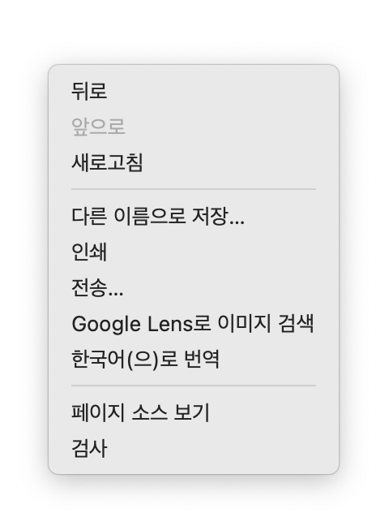 

2. 검사를 클릭, 또는 크롬 우측 점 세개 클릭 - 도구 더보기 클릭 - 개발자 도구 클릭

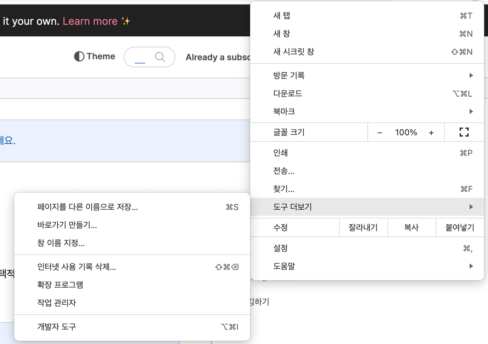 

3. 나온 창에서 console 클릭
  
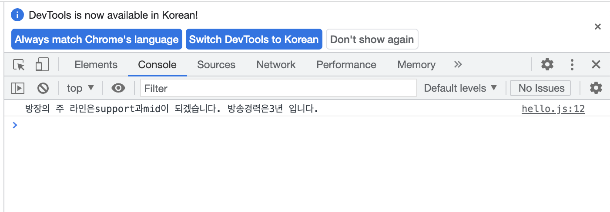 

4. 출력된 화면을 확인

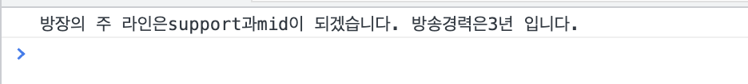 