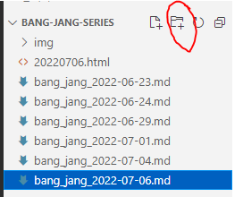

- 본 내용은 Flask(파이썬기반 웹 서버) 내용 들어가기 전 수일에 걸쳐 웹 개발에 필요한 요소를 정리하고자 합니다.
- 일부 간소화 한 부분도 있기 때문에 더 자세한 내용이 필요하신 분들은 직접 구글링이나 쪽지 혹은 댓글 남겨주시면 감사하겠습니다.(대답할 수 있는 선에서 대답해드립니다.)
- 본인은 자바(기반 웹, 시스템 프로그래밍)원툴이기 때문에 파이썬에 대해 부족한 부분이 많을 수 있으니 양해 바랍니다.

### 웹 개발 환경 구축
- 본격 정리에 들어가기 앞서 정리본에 사용되는 프로그램을 소개하고자 합니다.
- 아직까진 Flask(파이썬 기반의 웹 서버 라이브러리)는 사용하지 않기 때문에 웹 머저리 3대장(HTML, CSS, JAVASCRIPT) 들의 기준으로 작성함을 알립니다. 

#### IDE란?
- Intergrate Development Environment 의 약자로 통합 개발환경이라고 합니다.
- 코딩, 디버그, 컴파일, 배포 등 프로그램 개발에 관련된 모든 작업을 하나의 프로그램에서 처리하는 환경을 제공하는 소프트웨어입니다.
- Visual Studio Code, Atom, Intellij, Android Studio 등이 있습니다.
- 이 정리본은 Visual Studio Code 중심으로 다룰 예정입니다.

#### Visual Studio Code(통칭 VSC) 설치
1. https://code.visualstudio.com/ 접속

2. Download for Windows 클릭 후 설치 프로그램 다운로드

      - 이 화면이 뜨면서 설치파일이 다운로드 됩니다.
      - 만약 다운로드가 되지 않을 경우 중간에 "direct download link"를 눌러주세요

      - 인터넷 속도 이슈로 과거파일을 가져왔습니다.(귀찮은거 아님)
3. 설치한 폴더에 해당 파일을 실행시키거나 다운로드 완료 후 자동 실행으로 설치파일 실행시켜주세요.
4. 동의합니다 체크 후 다음클릭


5. 아이콘 추가 체크 외에 별다른거 할건 없습니다.(본인 기준) 다음클릭
  


6. 설치 클릭
   - PATH의 추가 기능은 명령 프롬포트(cmd)화면에서 명령어 입력으로 Visual Studio Code를 실행시키는 기능입니다.(본인도 잘 안씀)


7. 설치 완료(사진 생략) 후 메인화면
  - 아래의 사진이 뜰 것이고 완료됩니다
 


- 그 후 실행버튼을 누르면(사진 생략되었습니다.) 아래와 같은 메인 화면이 나옵니다.


8. 폴더 불러오기로 작업할 폴더를 선택합니다


   - 저의 경우 bang-jang-series를 선택하였습니다.


  - 열기 누른 후 환경입니다.


  - 위 사진의 빨간색 표시는 파일 생성입니다. 파일 생성 시 확장자(뒤에 .md, .html 등)까지 입력해주셔야 합니다.
  - 주로 .html, .md, .js, .py, .css 등으로 작성되실겁니다.



   - 위 사진의 빨간색 표시는 폴더 생성입니다. 작업 폴더로 선택한 폴더에 생성을 원하실 경우 바깥쪽을 한번 눌러주시고 생성해주시면 됩니다.


- 이상 visual studio code의 설치 설명을 마치겠습니다.
- 웹개발에 사용되는 편집기는 vsc외에 Atom, sublime text 등에서도 웹 개발이 가능합니다.
  - 해당 편집기의 설치는 글에 추가되는 링크로 참조해주시면 감사하겠습니다.
  - VSC 설치법 및 기본 사용법은 본인이 직접 작성함을 알립니다. 

### 강의에 사용되는 실습 템플릿 작성 (html)
- 먼저 html을 작성하기 위해서는 작성해야 할 요소가 많습니다. 따라서 이를 한번에 작성하는 방법을 정리하고자합니다.

1. 새로운 파일 생성 파일명.html 로 생성해주시면 됩니다.


2. 생성된 파일 안에 html입력


  - 입력시 위 사진과 같이 선택지가 있습니다. html:5를 선택해주세요

3. 생성된 템플릿


혹시 필요하신 분들을 위해 정리본 및 게시글에 올려드립니다

```
<!DOCTYPE html>
<html lang="en">
<head>
    <meta charset="UTF-8">
    <meta http-equiv="X-UA-Compatible" content="IE=edge">
    <meta name="viewport" content="width=device-width, initial-scale=1.0">
    <title>Document</title>
</head>
<body>
    hello world
</body>
</html>
```

4. 파일 저장 후 생성한 파일을 폴더 내 크롬 브라우저로 실행
- 만약 크롬 브라우저가 아닌 익스플로러나 엣지로 되어있을 경우(엣지 브라우저의 경우 상관은 없으나 편의상 크롬 브라우저로 통일하겠습니다.)
  1. 해당 폴더로 가서 html파일 우클릭
   
   
  
  2. 속성 클릭
   
   

  4. 중간에 연결 프로그램 변경 클릭 후 chrome선택 후 확인 클릭(이미 크롬이신분들은 안하셔도 됩니다.)
 
  

  5. 변경된 것 확인 후 하단에 적용 클릭
   
   

  6. 변경 확인

  

- 그 후 해당 파일을 실행시켜봅니다.

  

- html 파일 작성 시 <body>태그 안에서 작성을 진행합니다.
